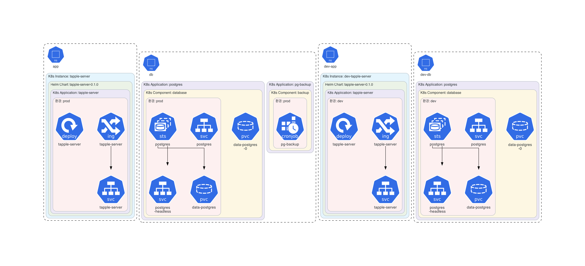
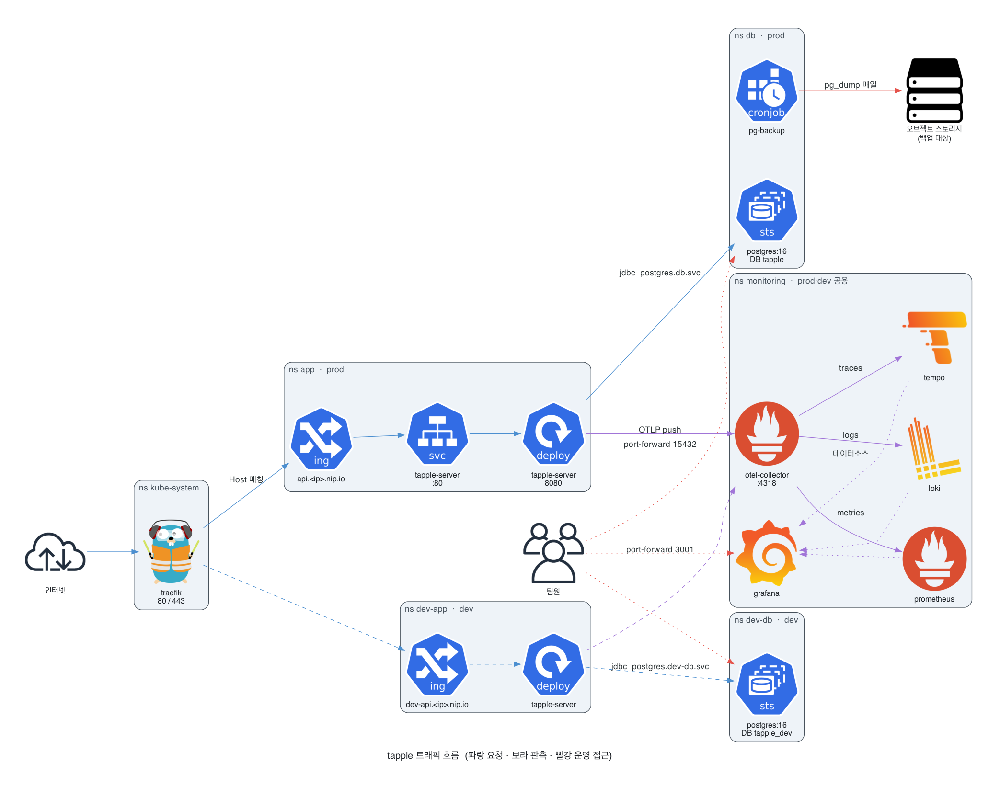
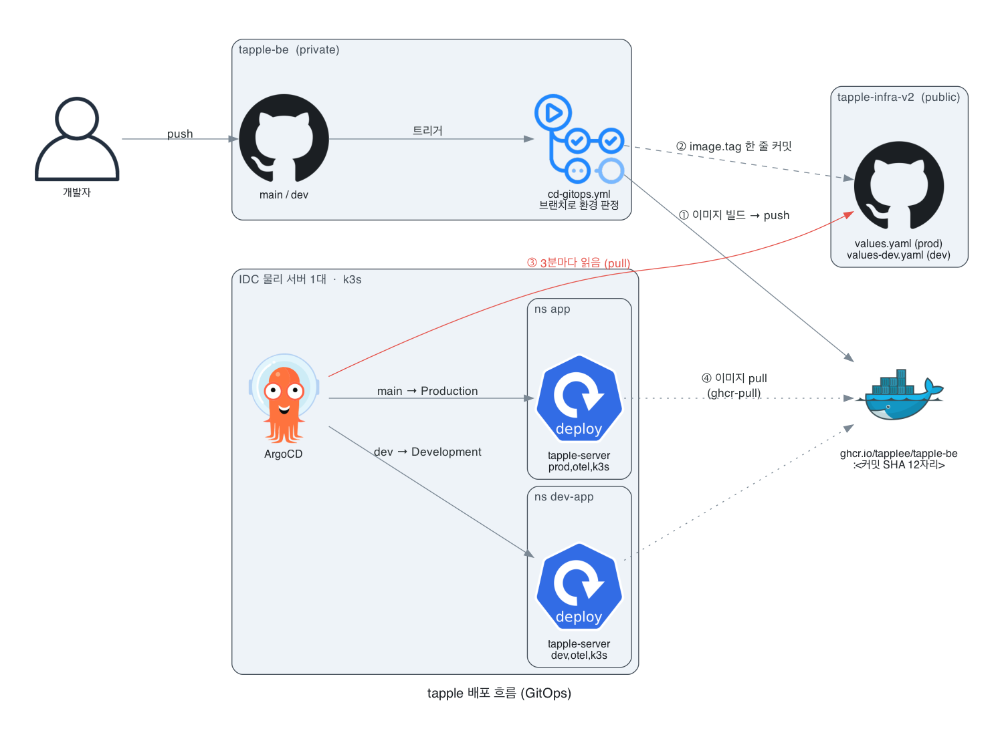
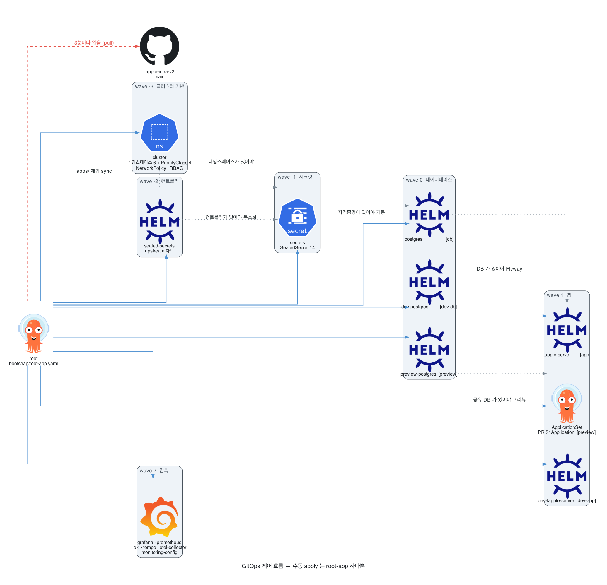

# tapple-infra-v2 — k3s GitOps

단일 노드 k3s 클러스터(**8 vCPU / 32GB**)의 **전체 상태 정의**. Git 커밋 = 배포. 배경과 결정 기록(D1~D19)은 [docs/k3s-migration-plan.md](docs/k3s-migration-plan.md).

앱 코드는 [tapple-be](https://github.com/Tapplee/tapple-be), AWS 시절 인프라와 **모니터링 대시보드 원본**은 [tapple-infra](https://github.com/Tapplee/tapple-infra)(v1), 부하 리그는 [tapple-loadtest](https://github.com/Tapplee/tapple-loadtest).

> 현재 상태: **임시 VPS에서 검증 중** (8 vCPU/31GB Ubuntu 24.04). ingress host는 그 VPS의 `nip.io` 주소로 잡혀 있다. iwinv 노드로 옮길 때 values의 host 두 줄만 실도메인으로 교체.

**이 레포는 public이다.** SealedSecret 암호문만 커밋하고 평문 시크릿은 절대 올리지 않는다(secret scanning + push protection 켜져 있음). ArgoCD는 public 레포라 자격증명 없이 pull한다 — private로 되돌리면 deploy key 등록이 필요해진다.

## 그림으로 보기

> 2026-08-11 클러스터 스냅샷. 재생성 절차는 [docs/diagrams/README.md](docs/diagrams/README.md).

**아키텍처** — 앱·DB 네임스페이스의 실제 리소스. 라이브 클러스터에서 KubeDiagrams 로 파생시킨 것이라 이 시점의 사실이다.

**prod 는 `app` + `db`, dev 는 `dev-app` + `dev-db`다.** prod 에 접두어가 없는 게 원래 매니페스트 관례라 이름만으로는 드러나지 않아, 각 리소스에 `environment` 라벨을 붙여 그림에 `환경: prod` / `환경: dev` 박스로 나오게 했다. `kubectl get ns -l environment=prod` 로도 고를 수 있다.

`data-postgres-0` PVC 하나만 그 박스 밖에 있다. StatefulSet 의 `spec.volumeClaimTemplates` 가 불변 필드라 라벨을 추가할 수 없다 — 넣으면 기존 워크로드 갱신이 admission 단계에서 거부된다.

<picture>
  
</picture>

모니터링 스택은 [architecture-platform.png](docs/diagrams/out/architecture-platform.png) 로 따로 뽑아뒀다 (grafana·prometheus·loki·tempo·otel-collector).

**트래픽 흐름** — 누가 누구를 부르는가. 파랑이 사용자 요청, 보라가 관측 데이터 push, 빨강이 운영자·팀원 접근이다. 이 연결들은 환경변수 안의 문자열이라 매니페스트에서 파생시킬 수 없어 손으로 그렸다.

<picture>
  <source media="(prefers-color-scheme: dark)"  srcset="docs/diagrams/out/traffic-flow-dark.png">
  <source media="(prefers-color-scheme: light)" srcset="docs/diagrams/out/traffic-flow.png">
  
</picture>

**배포 흐름** — 코드 push 부터 클러스터 반영까지. 빨간 화살표의 방향이 이 설계의 핵심이다: **ArgoCD 가 GitHub 을 읽는다(pull).** 앱 레포에서 클러스터로 가는 화살표가 없다.

<picture>
  <source media="(prefers-color-scheme: dark)"  srcset="docs/diagrams/out/cicd-flow-dark.png">
  <source media="(prefers-color-scheme: light)" srcset="docs/diagrams/out/cicd-flow.png">
  
</picture>

**GitOps 제어 흐름** — 수동 apply 는 `bootstrap/root-app.yaml` 하나뿐이고, 나머지 13개 Application 은 그것이 만든다. 점선이 순서 의존(sync wave)이다.

<picture>
  <source media="(prefers-color-scheme: dark)"  srcset="docs/diagrams/out/gitops-tree-dark.png">
  <source media="(prefers-color-scheme: light)" srcset="docs/diagrams/out/gitops-tree.png">
  
</picture>

## 구조

아래 트리는 **항상 맞는 부분**이다. 위 그림은 특정 시점의 스냅샷이고, 이 트리는 레포 구조 자체라 커밋 diff 에 드러나고 검색도 된다.

```
bootstrap/root-app.yaml     재구축 시 수동 apply하는 유일한 파일 (app-of-apps 루트)
apps/                       ArgoCD Application 정의 — root가 재귀 sync
  platform/                 환경 공용
    cluster.yaml              wave -3  → manifests/cluster/ (네임스페이스·PriorityClass)
    sealed-secrets.yaml       wave -2  upstream 차트 (시크릿 복호화 컨트롤러)
    secrets.yaml              wave -1  → secrets/ (prod·dev 모두 커버)
    monitoring/               wave 2   기존 compose 스택 이식 — prod·dev 공유
  prod/
    postgres.yaml             wave 0   → manifests/postgres/        [db]
    tapple-server.yaml        wave 1   → charts/tapple-server/      [app]
  dev/
    postgres.yaml             wave 0   → manifests/postgres-dev/    [dev-db]
    tapple-server.yaml        wave 1   → 같은 차트 + values-dev.yaml [dev-app]
charts/tapple-server/       자작 Helm 차트 (환경 공용) + values.yaml(prod)·values-dev.yaml
manifests/cluster/          네임스페이스 5개 + PriorityClass 3종
manifests/postgres/         prod DB — StatefulSet·Service·백업 CronJob
manifests/postgres-dev/     dev DB — 축소판 (백업 없음, 우선순위 최하)
manifests/monitoring/       대시보드 7개 + 알림 규칙 ConfigMap — 전부 gen-configmaps.py 산출물, 직접 고치지 말 것
secrets/                    kubeseal로 암호화된 SealedSecret만 (평문 금지 — secrets/README.md)
infra/                      노드 부트스트랩 셸 스크립트 (Phase 1~2)
scripts/gen-configmaps.py   v1의 대시보드·규칙 원본 → ConfigMap 변환
runbooks/                   재해 복구 절차
docs/db-access.md           팀원 DB 접속 가이드 (port-forward + 최소권한 RBAC)
```

## 동작 원리 (한 줄씩)

- **ArgoCD app-of-apps**: `root-app` 하나가 `apps/`를 재귀 sync해 Application들을 만들고, 각 Application이 자기 소스를 클러스터에 sync.
- **sync-wave**: 클러스터 기반(-3) → 컨트롤러(-2) → 시크릿(-1) → DB(0) → 앱(1) → 모니터링(2).
- **앱만 Helm**: 배포마다 바뀌는 값(image.tag)이 있는 건 앱뿐. DB는 바뀔 값이 없어 raw yaml (D17·D19).
- **upstream은 vendoring 안 함** (D16): Application 안에 차트 repo URL + `valuesObject`만.
- **배포 트리거는 앱 레포**: tapple-be의 `cd-gitops.yml`이 ghcr에 이미지를 밀고 이 레포의 `image.tag` 한 줄을 커밋한다. ArgoCD가 그걸 감지해 배포.

## 모니터링 원본은 이 레포가 아니다

`manifests/monitoring/*`은 **산출물**이다. 원본(대시보드 json·Prometheus·Loki 규칙)은 v1 `tapple-infra/monitoring/grafana/config`가 소유한다 — 부하 리그의 monitoring EC2가 같은 경로를 clone해 쓰기 때문에 옮기면 리그가 깨진다.

```bash
# 원본 고친 뒤 재생성 → 커밋
python3 scripts/gen-configmaps.py                        # 기본값: ../tapple-infra/monitoring/grafana/config
python3 scripts/gen-configmaps.py /다른/경로/config       # 원본 위치가 다르면
```

대시보드의 `Service` 드롭다운은 하드코딩이 아니라 **쿼리 변수**(`label_values(service_name)`)다. 그래서 환경마다 이름을 다르게 두면 드롭다운에서 골라 볼 수 있다 — prod `taple`, dev `taple-dev`. 같은 이름을 쓰면 두 환경 지표가 한 그래프에 섞인다.

이 값(`SPRING_APPLICATION_NAME`)은 Prometheus 의 `application` 라벨과 Loki·Tempo 의 `service_name` 에 동시에 반영된다. `DEPLOY_ENV`(→ `deployment_environment`)는 alertmanager 알림 제목이 우선 참조하는 라벨이라 함께 유지한다.

| 신호 | prod / dev 구분 |
|---|---|
| 대시보드 | `Service` 드롭다운 (`taple` / `taple-dev`) |
| Prometheus 알림 | 필터 없이 `sum by (application, service_name)` — 앱별로 따로 발생 |
| 알림 제목 | `deployment_environment` = prod / dev |
| Loki 로그 알림 | **prod 만** — 규칙이 `{service_name="taple"}` 하드코딩. dev 가 알림을 보내지 않는 건 의도된 동작 |

## 환경 (prod / dev)

**클러스터는 하나, 네임스페이스로 분리.** 브랜치로 환경을 나누지 않는다(안티패턴) — 인프라 레포는 항상 `main` 한 브랜치, 환경 차이는 디렉터리와 values 파일로만.

| | prod | dev |
|---|---|---|
| 네임스페이스 | `app` · `db` | `dev-app` · `dev-db` |
| 앱 리소스 (req / lim) | 4Gi·1000m / 6Gi·3000m | 2Gi·250m / 3Gi·1500m |
| DB 리소스 | **8Gi · 2000m Guaranteed** | 2Gi · 250m |
| PriorityClass | `app-important` / `db-critical` | `dev-low` (**압박 시 가장 먼저 축출**) |
| DB명 | `tapple` | `tapple_dev` |
| 백업 | pg_dump CronJob | 없음 (빈 DB + Flyway) |
| 관측 | 공유 스택 — `deployment_environment=prod` | 공유 스택 — `deployment_environment=dev` |
| 트리거 브랜치 | `main` → `values.yaml` | `develop` → `values-dev.yaml` |

## 리소스 예산 (8 vCPU / 32GB 노드)

`system-reserved`로 OS+k3s 몫 2Gi/1000m을 떼면 **allocatable ≈ 30Gi / 7 vCPU**.

| 대상 | requests | limits | QoS |
|---|---|---|---|
| prod PostgreSQL | 8Gi / 2000m | 8Gi / 2000m | **Guaranteed** |
| prod 앱 | 4Gi / 1000m | 6Gi / 3000m | Burstable |
| dev PostgreSQL | 2Gi / 250m | 2Gi / 1000m | Burstable |
| dev 앱 | 2Gi / 250m | 3Gi / 1500m | Burstable |
| 모니터링 스택 전체 | ~2.2Gi / 440m | ~3.3Gi | Burstable |
| ArgoCD + Traefik + sealed-secrets | ~1.3Gi / 530m | ~2Gi | Burstable |
| **합계 (requests)** | **~19.5Gi / 4.47 vCPU** | | 여유 **~10Gi / ~2.5 vCPU** |

- requests는 **스케줄러가 자리를 잡아두는 예약**일 뿐이라, 유휴 CPU는 limits 한도까지 다른 파드가 그대로 쓴다 → prod 앱은 순간 3코어까지 뻗을 수 있음.
- 축출 순서: `dev-low`(-100) → 모니터링·기본(0) → `app-important`(1000) → `db-critical`(1000000).
- PostgreSQL 튜닝값(`shared_buffers=2GB` 등)은 limits 8Gi에 맞춰져 있다 — **메모리를 바꾸면 args도 같이** 고칠 것.

## 로컬 검증 (클러스터 없이)

```bash
# prod 렌더
helm template tapple-server charts/tapple-server --set image.tag=test

# dev 렌더 (values 겹치기 — 뒤 파일이 앞을 덮어씀)
helm template dev-tapple-server charts/tapple-server \
  -f charts/tapple-server/values.yaml \
  -f charts/tapple-server/values-dev.yaml --set image.tag=test

helm lint charts/tapple-server --set image.tag=test
```

## 노드에 올리는 순서

```
①infra/node-bootstrap.sh  →  ②infra/k3s-setup.sh  →  ③시크릿 9종  →  앱 Running
```

②의 마지막 스텝이 `bootstrap/root-app.yaml`을 apply하고, 그때 sealed-secrets 컨트롤러가 뜬다. 시크릿을 **새로 만들어야 하는 경우**엔 그 뒤에만 가능하다(클러스터 공개키로 암호화) — 그전까지 DB·grafana·alertmanager 파드는 `CreateContainerConfigError`가 정상이다.

이미 `secrets/`에 SealedSecret이 커밋돼 있으므로 **같은 컨트롤러 키를 복원한 경우엔** ③이 자동으로 풀린다. 키를 잃으면 전부 재생성이다 — `secrets/README.md`의 개인키 백업 절차를 반드시 해둘 것.

앱 파드는 `image.tag`가 비어 있으면 Application이 `Unknown`으로 남는다(의도된 가드). tapple-be의 `cd-gitops.yml`이 태그를 커밋해야 뜬다.

## 남은 TODO

- [ ] Discord webhook 실값 — 지금은 더미라 알림이 아무데도 가지 않는다 (홈서버 `.env`도 `CHANGEME`)
- [ ] 컷오버 전 로테이션 — AWS 키·Google 시크릿·JWT 키. 지금 클러스터엔 앞 둘이 더미로 들어가 있다
- [ ] `ghcr-pull` 시크릿 2종 — 첫 이미지가 ghcr에 올라간 뒤. 패키지를 public으로 두면 불필요
- [ ] 도메인 확정 — 지금은 nip.io. `charts/tapple-server/values.yaml`·`values-dev.yaml`의 `ingress.host` 두 줄
- [ ] tapple-be에 `INFRA_REPO_TOKEN` 시크릿 등록 + `cd-gitops.yml` push 트리거 주석 해제 (컷오버 시)
- [ ] upstream 차트 버전 5종 설치 시점 최신 고정 (sealed-secrets + monitoring 4종 — 내부 이미지 태그는 compose와 동일하게 이미 고정)
- [ ] iwinv 플랜 상품 코드·월 요금 확인 — 매니페스트는 **8 vCPU / 32GB** 기준
- [ ] Traefik `trustedIPs`(Cloudflare 대역) — 없으면 로그·레이트리밋에 실 사용자 IP 대신 Cloudflare IP가 찍힘
- [ ] ghcr retention — 오래된 이미지 자동 삭제 (최근 N개 + 배포 중 태그는 보존)
- [ ] 매니페스트 lint CI (helm template·kubeconform)
- [ ] 대시보드의 AWS 잔재 정리 — `AWS Region`·`RDS Instance` 변수와 그 패널들이 CloudWatch 데이터소스를 요구한다. k3s 에는 Prometheus·Loki·Tempo·Alertmanager 4종만 프로비저닝돼 있어 해당 패널은 에러로 뜬다 (원본은 v1 소유)
- [ ] 팀원 kubeconfig 발급 — [docs/db-access.md](docs/db-access.md) §6 (토큰 기본 90일, 만료 시 재발급)
- [ ] BE의 `prod` 프로파일에서 CloudWatch appender 제거 또는 k3s 전용 프로파일 — AWS 떠난 뒤엔 무의미
- [x] 시크릿 7종 씰링 (`secrets/`) — 부팅 필수값만 실값, 나머지 더미
- [x] k3s v1.36.3+k3s1 · ArgoCD v3.5.0 버전 고정 (`infra/k3s-setup.sh`)
- [x] DB명(`tapple`)·Hikari 풀(10) ↔ `max_connections=60` 매칭
- [x] 알림 채널 — Discord webhook, 기존 alertmanager 라우팅 그대로
- [x] 모니터링 원본/산출물 경계 — 원본은 v1 유지, 여기는 산출물만
