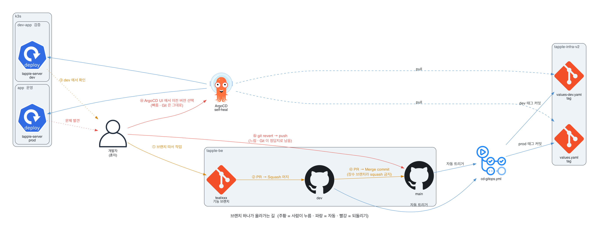
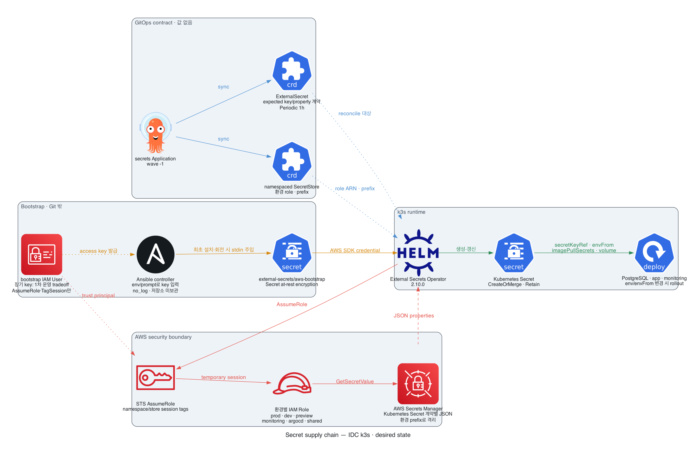

# tapple-infra-v2 — k3s GitOps

IDC의 Ubuntu 22.04/24.04 x86_64 물리 서버 한 대에 올릴 단일 노드 k3s 클러스터
(현재 용량 가정 **8 vCPU / 32GB**)의 **desired state**다. Git 커밋 = 배포. 배경과
결정 기록(D1~D19)은 [docs/k3s-migration-plan.md](docs/k3s-migration-plan.md).

앱 코드는 [tapple-be](https://github.com/Tapplee/tapple-be), AWS 시절 인프라와 **모니터링 대시보드 원본**은 [tapple-infra](https://github.com/Tapplee/tapple-infra)(v1), 부하 리그는 [tapple-loadtest](https://github.com/Tapplee/tapple-loadtest).

> 현재 상태: **운영 전 desired state**다. 2026-08에 임시 VPS에서 검증한 기록은 남아 있지만,
> 최종 목표는 특정 VPS 사업자에 종속되지 않는 IDC 물리 서버 한 대다. 발주한 서버의 실제
> CPU·메모리·디스크·회선과 관리자 공인 CIDR을 확인한 뒤 Ansible inventory와 도메인을 채운다.
>
> 2026-08-31 시크릿 설계를 AWS Secrets Manager + External Secrets Operator(ESO) 2.10.0으로
> 전면 교체했다. 아직 운영 전이라 기존 값은 인수하지 않는다. AWS 계정 ID와 13개의 JSON
> Secret을 채우기 전에는 `secrets` Application과 후속 wave가 의도적으로 준비 완료되지 않는다.

**이 레포는 public이다.** 평문·암호문 시크릿은 모두 금지하고 Secrets Manager 이름·JSON
property 계약과 IAM 정책만 커밋한다(secret scanning + push protection 켜져 있음). ArgoCD는
public 레포라 자격증명 없이 pull한다 — private로 되돌리면 deploy key 등록이 필요해진다.

## 그림으로 보기

> `architecture-app`·`architecture-platform`은 2026-08-12 라이브 테스트 클러스터에서 뽑은
> **pre-ESO 스냅샷**이다. 현재 구현을 나타내는 GitOps·프리뷰·시크릿 공급망 그림은
> **desired state**이며 둘을 섞어 읽지 않는다. 재생성 절차는
> [docs/diagrams/README.md](docs/diagrams/README.md). 그림 렌더링은 수동이고,
> `.github/workflows/validate.yml`은 Helm·Ansible·CloudFormation 정적 검증을 맡는다.

**아키텍처 스냅샷** — 앱·DB 네임스페이스의 실제 리소스. 2026-08-12 라이브 테스트
클러스터에서 KubeDiagrams로 파생시킨 당시의 사실이며, 현재 Secrets Manager/ESO 구조는
아래 desired-state 그림을 본다.

**prod 는 `app` + `db`, dev 는 `dev-app` + `dev-db`다.** prod 에 접두어가 없는 게 원래 매니페스트 관례라 이름만으로는 드러나지 않아, 각 리소스에 `environment` 라벨을 붙여 그림에 `환경: prod` / `환경: dev` 박스로 나오게 했다. `kubectl get ns -l environment=prod` 로도 고를 수 있다.

`data-postgres-0` PVC 하나만 그 박스 밖에 있다. StatefulSet 의 `spec.volumeClaimTemplates` 가 불변 필드라 라벨을 추가할 수 없다 — 넣으면 기존 워크로드 갱신이 admission 단계에서 거부된다.

<picture>
  
</picture>

모니터링 스택은 [architecture-platform.png](docs/diagrams/out/architecture-platform.png) 로 따로 뽑아뒀다 (grafana·prometheus·loki·tempo·otel-collector).

**트래픽 흐름** — 누가 누구를 부르는가. 파랑이 사용자 요청, 보라가 관측 데이터 push, 빨강이 운영자·팀원 접근이다. 앱의 외부 경로는 **아직 닫힌 컷오버 경로**다. prod·dev·preview Ingress는 기본적으로 렌더되지 않고, 실제 host와 origin TLS Secret을 준비해 명시적으로 켠 뒤에만 Cloudflare→443→Traefik 경로가 생긴다. 이 연결들은 환경변수 안의 문자열이라 매니페스트에서 파생시킬 수 없어 손으로 그렸다.

<picture>
  <source media="(prefers-color-scheme: dark)"  srcset="docs/diagrams/out/traffic-flow-dark.png">
  <source media="(prefers-color-scheme: light)" srcset="docs/diagrams/out/traffic-flow.png">
  
</picture>

**배포 흐름** — 코드 merge부터 클러스터 반영까지. 앱 Actions가 SHA 이미지를 만든 뒤 인프라
브랜치와 `image.tag` PR을 열고, 필수 `Static validation`을 통과한 PR만 squash auto-merge한다.
빨간 화살표의 방향이 이 설계의 핵심이다: **보호 적용 후 ArgoCD가 `origin/main`을 읽는다(pull).**
앱 레포에서 클러스터로 가는 화살표는 없다.

<picture>
  <source media="(prefers-color-scheme: dark)"  srcset="docs/diagrams/out/cicd-flow-dark.png">
  <source media="(prefers-color-scheme: light)" srcset="docs/diagrams/out/cicd-flow.png">
  
</picture>

**브랜치 하나가 올라가는 길** — 기능 브랜치를 따서 dev를 거쳐 prod까지 가는 순서와,
잘못됐을 때 되돌리는 두 경로다. **주황이 사람이 눌러야 하는 것, 파랑이 자동, 빨강이
되돌리기**다. 각 환경 merge 뒤의 인프라 tag 변경은 PR·필수 CI·auto-merge를 거쳐야 한다.
여러 명이 동시에 작업할 때 `dev`를 서로 덮는 문제는 아래 PR 프리뷰가 담당한다.

<picture>
  <source media="(prefers-color-scheme: dark)"  srcset="docs/diagrams/out/branch-flow-dark.png">
  <source media="(prefers-color-scheme: light)" srcset="docs/diagrams/out/branch-flow.png">
  
</picture>

앱 승격에서 사람이 결정하는 지점은 브랜치 생성, dev PR merge, dev 확인, main PR merge다.
그 뒤 환경별 인프라 PR은 CI가 통과하면 자동 merge된다. 적용할 보호 정책은 sole owner라
인프라 필수 승인을 0명으로 두되 관리자 우회·직접 push·force-push·삭제를 막는다. 두 번째 신뢰 가능한
maintainer가 생기면 승인을 1명으로 올린다.

되돌리기는 두 경로가 있고 성질이 다르다.

| | 방법 | 속도 | Git 상태 |
|---|---|---|---|
| ⓐ | ArgoCD UI → HISTORY → 이전 버전 | 초 단위 | 그대로. **self-heal 이 다시 최신으로 되돌릴 수 있다** — 임시 조치 |
| ⓑ | known-good `image.tag` revert PR → 필수 CI | 분 단위 | Git 이 정답지로 남는다. **영구 조치** |

급하면 ⓐ 로 막고, ⓑ 로 마무리한다. ⓐ 만 하고 끝내면 다음 sync 에서 되살아난다.

**PR 프리뷰** — PR 하나마다 그 브랜치만의 내부 workload와 database가 뜬다. `dev` 환경이
하나뿐이라 여러 명이 각자 확인하려면 `dev`에 머지해야 하고, 나중에 머지한 사람이 앞사람
걸 덮는 문제를 없앤다. 사용법은 [docs/preview-environments.md](docs/preview-environments.md).

<picture>
  <source media="(prefers-color-scheme: dark)"  srcset="docs/diagrams/out/preview-env-dark.png">
  <source media="(prefers-color-scheme: light)" srcset="docs/diagrams/out/preview-env.png">
  
</picture>

`preview` 라벨을 붙이면 3~5분 후 내부 Deployment·Service와 PR별 database가 생기고,
PR을 닫으면 workload가 사라진다. 현재는 Ingress가 기본 비활성이라 외부 URL은 없다.
외부 공개가 필요하면 실제 1단 host·PR별 TLS Secret 공급 방식을 먼저 정하고
`ingress.enabled=true`를 명시해야 한다. **라벨이 곧 자리 예약**이라 다 본 PR은 떼야 한다 —
`ResourceQuota`가 동시 6개를 강제한다.

**GitOps 제어 흐름** — bootstrap 경계 밖에서 Ansible이 Argo CD·health gate·
`bootstrap/root-app.yaml`을 적용하고, root가 나머지 14개 Application을 만든다. 점선은
순서 의존(sync wave)이다. `Application`·`SecretStore`·`ExternalSecret` custom health가
실제 `Healthy`/`Ready=True`까지 확인하므로 오브젝트 생성만 하고 다음 wave로 넘어가지 않는다.

`preview` 의 ApplicationSet 만 성질이 다르다 — Application 을 **런타임에 더 만든다**. Git 에 없는 Application 이 클러스터에 생기는 유일한 경로다.

<picture>
  <source media="(prefers-color-scheme: dark)"  srcset="docs/diagrams/out/gitops-tree-dark.png">
  <source media="(prefers-color-scheme: light)" srcset="docs/diagrams/out/gitops-tree.png">
  
</picture>

**시크릿 공급망** — Ansible이 secret-zero 하나만 Git 밖에서 넣고, ESO가 환경별 역할을
가정해 Secrets Manager의 JSON Secret을 Kubernetes Secret으로 만든다. 구현은 IAM role 6개,
namespaced `SecretStore` 10개, source 13개, `ExternalSecret` 15개다.

<picture>
  <source media="(prefers-color-scheme: dark)"  srcset="docs/diagrams/out/secret-supply-chain-dark.png">
  <source media="(prefers-color-scheme: light)" srcset="docs/diagrams/out/secret-supply-chain.png">
  
</picture>

session tag는 잘못된 Store 연결을 막고 CloudTrail 감사를 돕지만, bootstrap key 소유자는
유효한 tag를 직접 골라 여섯 역할 모두를 가정할 수 있다. 따라서 보안 경계로 과장하지 않는다.
이 장기 key는 Phase 1 부채이며, 필요해지면 IAM Roles Anywhere의 단기 자격증명으로 교체한다.

ESO도 단일 cluster-wide controller라 upstream ClusterRole이 모든 namespace의 Kubernetes
Secret을 관리한다. 지금처럼 한 운영자가 관리하는 단일 팀 클러스터에서는 이 운영 경계를
수용한다. namespace를 다른 팀에 위임하거나 외부 PR 워크로드를 받기 시작하면 controller와
AWS bootstrap principal을 prod/non-prod 경계로 분리한다.

Argo CD application controller도 클러스터 전체를 조정하므로 이 레포의 `origin/main`이 사실상
cluster-admin trust root다. 공개 읽기 자체는 배포 권한이 아니지만 main 쓰기 권한은 그렇다.
운영 컷오버 전 변경을 먼저 원격에 올려 `Static validation` 성공을 확인하고, 앱 배포를 PR
기반으로 바꾼 뒤, 조직 2FA를 GitHub UI에서 수동으로 강제한다. 마지막에 branch protection을
적용해야 기존 direct-push 배포를 먼저 잠그는 교착을 피한다. 단계와 검증은
[GitHub trust root](docs/github-trust-root.md)를 따른다.

## 구조

아래 트리는 **항상 맞는 부분**이다. 위 그림은 특정 시점의 스냅샷이고, 이 트리는 레포 구조 자체라 커밋 diff 에 드러나고 검색도 된다.

```
ansible/                    IDC 단일 노드 canonical bootstrap (Ubuntu 22.04/24.04)
bootstrap/root-app.yaml     Ansible이 마지막에 적용하는 app-of-apps 루트
apps/                       ArgoCD Application 정의 — root가 재귀 sync
  platform/                 환경 공용
    cluster.yaml              wave -3  → manifests/cluster/ (namespace·RBAC·health gate)
    external-secrets.yaml     wave -2  upstream ESO 2.10.0 (Secrets Manager → Secret)
    secrets.yaml              wave -1  → charts/tapple-secrets/ (환경별 계약)
    monitoring/               wave 2   기존 compose 스택 이식 — prod·dev 공유
  prod/
    postgres.yaml             wave 0   → manifests/postgres/        [db]
    tapple-server.yaml        wave 1   → charts/tapple-server/      [app]
  dev/
    postgres.yaml             wave 0   → manifests/postgres-dev/    [dev-db]
    tapple-server.yaml        wave 1   → 같은 차트 + values-dev.yaml [dev-app]
  preview/                    PR 프리뷰 — docs/preview-environments.md
    postgres.yaml               공유 DB 1대                          [preview]
    applicationset.yaml         PR 하나당 Application 자동 생성·삭제
charts/tapple-server/       자작 앱 Helm 차트 + values.yaml(prod)·values-dev.yaml·values-preview.yaml
charts/tapple-secrets/      10 SecretStore·15 ExternalSecret·JSON property 계약 (값 없음)
manifests/cluster/          namespace·PSA warn/audit·PriorityClass·RBAC + Argo CD custom health
manifests/postgres/         prod DB — PostgreSQL 16.15 digest·Service·NetworkPolicy·AWS S3 backup CronJob(활성화 gate)·읽기전용 롤 Job
manifests/postgres-dev/     dev DB — 축소판 (백업 없음, 우선순위 최하) + NetworkPolicy
manifests/postgres-preview/ 프리뷰 공유 DB + 고아 database 정리 CronJob
manifests/monitoring/       대시보드 7개·알림 규칙 ConfigMap(gen 산출물) + NetworkPolicy
secrets/                    Secrets Manager/IAM/bootstrap/rotation 운영 가이드 (값 없음)
infra/                      ESO IAM·전용 backup S3/IAM CloudFormation + legacy shell fallback
scripts/gen-configmaps.py   v1의 대시보드·규칙 원본 → ConfigMap 변환
scripts/gen-team-kubeconfig.sh  팀원용 SA 토큰 kubeconfig 발급 (기본 90일)
scripts/bootstrap-external-secrets-aws.sh  legacy secret-zero fallback (표준은 Ansible)
runbooks/                   재해 복구 절차
docs/db-access.md           팀원 DB 접속 가이드 (port-forward + 최소권한 RBAC)
docs/monitoring-access.md   팀원 Grafana 접속 — 승인 로컬 계정, origin TLS, PR별 관측법
docs/preview-environments.md  PR 프리뷰 사용법 — 팀원이 먼저 읽을 문서
.github/workflows/validate.yml  Helm·Kubernetes·알림·Ansible·CloudFormation 정적 검증 (`Static validation`)
docs/diagrams/              위 그림들의 생성 스크립트 (렌더링은 수동)
```

## 동작 원리 (한 줄씩)

- **ArgoCD app-of-apps**: `root-app` 하나가 `apps/`를 재귀 sync해 Application들을 만들고, 각 Application이 자기 소스를 클러스터에 sync.
- **sync-wave + health gate**: 클러스터 기반(-3) → 컨트롤러(-2) → 시크릿(-1) → DB(0) → 앱(1) → 모니터링(2). 자식 Application과 ESO 리소스가 실제 준비될 때까지 기다린다.
- **앱과 시크릿 계약만 Helm**: 앱은 환경별 values를 합치고, 시크릿 차트는 계정 ID로 IAM role ARN을 만든다. DB는 raw yaml (D17·D19).
- **upstream은 vendoring 안 함** (D16): Application 안에 차트 repo URL + `valuesObject`만.
- **배포 트리거는 앱 레포**: tapple-be의 `cd-gitops.yml`이 ghcr에 SHA 이미지를 밀고 `deploy/<environment>/<sha>` 브랜치에서 이 레포의 `image.tag` PR을 연다. 필수 `Static validation` 뒤 squash auto-merge되면 ArgoCD가 감지해 배포.
- **프리뷰는 Git 에 없다**: ApplicationSet 이 GitHub PR 목록을 2분마다 읽어 `preview` 라벨이 붙은 PR 만큼 Application 을 만든다. 라벨을 떼거나 PR 을 닫으면 지운다 — 커밋이 필요 없는 유일한 배포 경로다.
- **앱 Ingress는 fail-closed**: prod·dev·preview 모두 기본 비활성이다. 켤 때는 실제 host, 같은 host를 포함한 비어 있지 않은 TLS Secret, Traefik `websecure` 경로를 함께 만족해야 Helm render가 성공한다.
- **시크릿 원본은 AWS Secrets Manager**: Git에는 값이 없다. ESO가 환경별 IAM 역할을 가정해 JSON property를 기존 Kubernetes Secret key로 명시적으로 동기화한다. 상세 절차는 [secrets/README.md](secrets/README.md).

## 모니터링 원본은 이 레포가 아니다

`manifests/monitoring/*`은 **산출물**이다. 원본(대시보드 json·Prometheus·Loki 규칙)은 v1 `tapple-infra/monitoring/grafana/config`가 소유한다 — 부하 리그의 monitoring EC2가 같은 경로를 clone해 쓰기 때문에 옮기면 리그가 깨진다.

```bash
# 원본 고친 뒤 재생성 → 커밋
python3 scripts/gen-configmaps.py                        # 기본값: ../tapple-infra/monitoring/grafana/config
python3 scripts/gen-configmaps.py /다른/경로/config       # 원본 위치가 다르면
```

대시보드의 `Service` 드롭다운은 하드코딩이 아니라 **쿼리 변수**(`label_values(service_name)`)다. 그래서 환경마다 이름을 다르게 두면 드롭다운에서 골라 볼 수 있다 — prod `taple`, dev `taple-dev`. 같은 이름을 쓰면 두 환경 지표가 한 그래프에 섞인다.

이 값(`SPRING_APPLICATION_NAME`)은 Prometheus 의 `application` 라벨과 Loki·Tempo 의 `service_name` 에 동시에 반영된다. `DEPLOY_ENV`(→ `deployment_environment`)는 alertmanager 알림 제목이 우선 참조하는 라벨이라 함께 유지한다.

| 신호 | prod / dev 구분 |
|---|---|
| 대시보드 | `Service` 드롭다운 (`taple` / `taple-dev`) |
| Prometheus 알림 | 필터 없이 `sum by (application, service_name)` — 앱별로 따로 발생 |
| 알림 제목 | `deployment_environment` = prod / dev |
| Loki 로그 알림 | **prod 만** — 규칙이 `{service_name="taple"}` 하드코딩. dev 가 알림을 보내지 않는 건 의도된 동작 |

availability alert는 실제 scrape target(node-exporter·Tempo·Collector·kube-state-metrics·
Loki·Prometheus·Alertmanager·Grafana)에만 둔다. 앱은 세 환경 모두 trace head sampling을
`1.0`으로 고정하고 Collector도 sampling processor 없이 Tempo로 전달한다. 이는 의도적 sampling이
없다는 뜻이지 장애·memory limiter·queue 포화에도 무손실이라는 뜻은 아니므로 수신 거부·queue·
export 실패를 별도 경보한다. Prometheus와 Alertmanager도 같은 단일 노드에 있으므로
노드·클러스터·회선 전체가 죽으면 알림도 같이 죽는다. `NodeExporterDown`은 Prometheus가
살아 있을 때의 exporter/scrape 장애일 뿐이며, 전체-node 감시는 IDC 밖 uptime monitor가 맡아야 한다.

## 환경 (prod / dev)

**클러스터는 하나, 네임스페이스로 분리.** 브랜치로 환경을 나누지 않는다(안티패턴) — 인프라 레포는 항상 `main` 한 브랜치, 환경 차이는 디렉터리와 values 파일로만.

| | prod | dev | PR 프리뷰 |
|---|---|---|---|
| 네임스페이스 | `app` · `db` | `dev-app` · `dev-db` | `preview` (전부 한 곳) |
| 앱 리소스 (req / lim) | 4Gi·1000m / 6Gi·3000m | 2Gi·250m / 3Gi·1500m | 1Gi·200m / 2Gi·1500m |
| DB | 전용 8Gi Guaranteed | 전용 2Gi | 공유 1대 1Gi, PR 당 database |
| PriorityClass | `app-important` / `db-critical` | `dev-low` | `preview-lowest` (**가장 먼저 축출**) |
| DB명 | `tapple` | `tapple_dev` | `tapple_pr<PR번호>` |
| 외부 Ingress | 기본 비활성 | 기본 비활성 | 기본 비활성 |
| 백업 | 전용 AWS S3로 매일 03:00 Asia/Seoul, 지연 허용 1h (`suspend: true`, restore 리허설 후 활성화) | 없음 | 없음 (7일 미접속 시 database 삭제) |
| 관측 | `service_name=taple` | `taple-dev` | `taple-pr<번호>` |
| 트리거 | 앱 `main` merge | 앱 `dev` merge | PR 에 `preview` 라벨 |

**동시 프리뷰의 정책 상한은 6개다.** 명시된 상주 request 뒤 계산상 여유는 약 7.05Gi이고
PR당 1Gi를 예약하지만, 이 값에는 Traefik·일부 k3s 시스템 파드와 실제 사용량이 빠져 있다.
`preview-budget` ResourceQuota가 Deployment 6개와 namespace 예산을 강제하되, 실제 IDC에서
6개가 동시에 안정적인지는 부하·eviction 실측으로 다시 확인한다. `preview` 라벨이 곧 자리
예약이라 다 본 PR은 떼야 한다.

## 네트워크 격리

네임스페이스 분리만으로 네트워크가 막히지는 않으므로 민감한 경로를 NetworkPolicy로 닫는다.
DB는 환경별 앱/DB namespace만 받고, monitoring은 default-deny ingress 뒤 필요한 내부 scrape,
앱 namespace의 OTLP, Traefik→Grafana만 허용한다. egress와 app/preview namespace 전체를
default-deny로 만들지는 않았으므로 이것을 완전한 멀티테넌트 격리로 보지 않는다.

| 대상 | 허용 | 파일 |
|---|---|---|
| prod DB | `app` · `db` 네임스페이스만 | `manifests/postgres/networkpolicy.yaml` |
| dev DB | `dev-app` · `dev-db` 네임스페이스만 | `manifests/postgres-dev/networkpolicy.yaml` |
| 프리뷰 DB | 제한 없음 | 프리뷰 전용 데이터라 의도적으로 열어둠 |
| monitoring ingress | 같은 namespace, 앱 namespace→OTLP 4317/4318, Traefik→Grafana 3000 | `manifests/monitoring/networkpolicy.yaml` |

팀원의 `kubectl port-forward` 는 **NetworkPolicy 대상이 아니다** — kubelet 이 노드에서 프록시하므로 파드 간 트래픽이 아니다. 그 경로의 접근 통제는 RBAC(`manifests/cluster/team-access.yaml`)이 한다.

Kubernetes API `6443`은 Ansible에서 기본적으로 외부 차단한다. `common_k3s_api_cidrs`가
비어 있으면 local/SSH 경로로만 운영하고, 팀원 kubeconfig가 꼭 필요할 때만 고정 팀/VPN egress
CIDR을 넣는다. preflight가 `0.0.0.0/0`과 public port의 22/6443을 원격 변경 전에 거부한다.
Ansible은 현재 SSH peer가 allowlist에 남는지 먼저 확인하고, 원하는 규칙을 추가한 뒤
목록에 없는 UFW 인바운드 allow를 제거하며 새 SSH 연결까지 검증한다. 별도로 관리하지
않는 `ufw route allow/limit`, 인바운드 deny/reject, quoted application-profile 규칙이 있으면
방화벽을 바꾸기 전에 안전하게 실패한다.

공용 origin 포트는 **Cloudflare 공식 IPv4/IPv6 CIDR에서 오는 `443/tcp`만** 허용한다.
공용 `80/tcp`와 source 제한 없는 `443/tcp`는 preflight와 최종 exact-set 검증에서 거부한다.
따라서 앱 Ingress를 켜더라도 proxied DNS와 origin TLS가 없으면 외부 경로가 생기지 않는다.

## 리소스 예산 (8 vCPU / 32GB 노드)

실측 capacity 31.3Gi에서 `system-reserved` 2Gi와 hard eviction 여유 1Gi를 떼면
**allocatable ≈ 28.3Gi / 7 vCPU**다.

| 대상 | requests | limits | QoS |
|---|---|---|---|
| prod PostgreSQL | 8Gi / 2000m | 8Gi / 2000m | **Guaranteed** |
| prod 앱 | 4Gi / 1000m | 6Gi / 3000m | Burstable |
| dev PostgreSQL | 2Gi / 250m | 2Gi / 1000m | Burstable |
| dev 앱 | 2Gi / 250m | 3Gi / 1500m | Burstable |
| 프리뷰 공유 PostgreSQL | 1Gi / 200m | 1Gi / 1000m | Burstable |
| 모니터링 스택 전체 | 3536Mi(~3.45Gi) / 955m | memory 6560Mi(~6.41Gi) | Burstable |
| ArgoCD | 688Mi(~0.67Gi) / 400m | memory 2752Mi(~2.69Gi) / CPU 4200m | Burstable |
| External Secrets | 128Mi / 40m | memory 256Mi | Burstable |
| Traefik·k3s 시스템 파드 | 배포 후 실측 | 배포 후 실측 | upstream/내장 |
| **명시된 상주 requests 소계** | **21760Mi(21.25Gi) / 5095m** | | 계산상 여유 약 7.05Gi / 1.9 vCPU. Traefik·k3s 시스템 파드와 프리뷰 앱은 별도 |

- requests는 **스케줄러가 자리를 잡아두는 예약**일 뿐이라, 유휴 CPU는 limits 한도까지 다른 파드가 그대로 쓴다 → prod 앱은 순간 3코어까지 뻗을 수 있음.
- 축출 순서: `dev-low`(-100) → 모니터링·기본(0) → `app-important`(1000) → `db-critical`(1000000).
- PostgreSQL 튜닝값(`shared_buffers=2GB` 등)은 limits 8Gi에 맞춰져 있다 — **메모리를 바꾸면 args도 같이** 고칠 것.
- kubelet hard eviction은 메모리뿐 아니라 node/image filesystem 가용량과 inode도 함께 보호한다: `1Gi`, `10%`, `15%`, `5%`, `5%`.
- namespace의 `restricted:v1.36` PSA는 현재 **warn/audit only**다. 위반을 관측한 뒤 enforce로 올리며, 지금은 admission 차단 경계가 아니다.

## 로컬 검증 (클러스터 없이)

```bash
# prod 렌더
helm template tapple-server charts/tapple-server --set image.tag=test

# dev 렌더 (values 겹치기 — 뒤 파일이 앞을 덮어씀)
helm template dev-tapple-server charts/tapple-server \
  -f charts/tapple-server/values.yaml \
  -f charts/tapple-server/values-dev.yaml --set image.tag=test

# preview 렌더 (ApplicationSet 이 넘기는 값은 --set 으로 흉내낸다)
helm template tapple-preview-27 charts/tapple-server \
  -f charts/tapple-server/values.yaml \
  -f charts/tapple-server/values-preview.yaml \
  --set image.tag=test --set fullnameOverride=tapple-server-pr-27 \
  --set createDatabase.name=tapple_pr27

helm lint charts/tapple-server --set image.tag=test

# 외부 Ingress는 실제 host와 TLS를 한 번에 줄 때만 명시적으로 렌더
helm template tapple-server charts/tapple-server \
  --set ingress.enabled=true \
  --set-string ingress.host=api.example.com \
  --set-string ingress.tls[0].secretName=cloudflare-origin-cert \
  --set-string ingress.tls[0].hosts[0]=api.example.com

# Secrets Manager 계약 차트 — 실제 계정 ID 대신 형식만 맞는 테스트 값
helm lint charts/tapple-secrets --set-string aws.accountId=123456789012
helm template tapple-secrets charts/tapple-secrets \
  --set-string aws.accountId=123456789012

# Ansible과 AWS IAM 정적 검증 (requirements 설치 후)
(cd ansible && ansible-playbook --syntax-check \
  -i inventories/idc/hosts.example.yml playbooks/bootstrap.yml)
(cd ansible && ansible-lint playbooks/bootstrap.yml)
cfn-lint infra/aws/*.yaml
```

같은 핵심 검사는 `.github/workflows/validate.yml`이 push와 PR에서 수행한다. 클러스터가 있으면
`kubectl apply --dry-run=server -f <파일>`이 불변 필드 위반까지 잡는다. **단 Job은 spec이
불변이라 이 검사를 통과할 수 없다**(위 함정 항목).

## 노드에 올리는 순서

```
①AWS IAM 역할 6개 + Secrets Manager JSON Secret 13개 준비
→ ②charts/tapple-secrets/values.yaml에 AWS 계정 ID 설정
→ ③ansible/inventories/idc/hosts.yml 검토
→ ④ansible/playbooks/bootstrap.yml 실행
→ ⑤Application·SecretStore·ExternalSecret health gate 통과
→ 앱 Running
```

Ansible은 Cloudflare-only 443 UFW·SSH·swap·커널 설정, 고정 버전 k3s와 완전한 eviction 기준,
resource patch가 적용된 Argo CD, datastore의 Secret at-rest 암호화, custom health,
`external-secrets/aws-bootstrap`, root Application을 순서대로 구성한다.
AWS Secret이나 JSON property가 하나라도 빠지면 해당 ExternalSecret이 Ready가 되지 않고
후속 wave도 진행되지 않으며, root가 `Synced + Healthy`가 되지 않아 playbook도 성공 종료하지
않는다. `infra/k3s-setup.sh`는 표준 경로가 아니라 복구용 fallback이다.

**RTO 10분은 대체 노드가 이미 준비된 뒤 소프트웨어를 재구축하는 목표에만 해당한다.** 물리
서버 자체가 소실되면 하드웨어 교체와 IDC 원격 손 대응은 공급자 SLA에 달려 있어 수시간 이상
걸릴 수 있다. 단일 노드에서 그 구간까지 10분으로 약속할 수는 없다.

앱 파드는 `image.tag`가 비어 있으면 Application이 `Unknown`으로 남는다(의도된 가드).
tapple-be의 `cd-gitops.yml`이 태그 PR을 만들고 필수 CI를 통과시켜야 뜬다. PostgreSQL 본체와
관련 Job은 모두 `postgres:16.15-bookworm`의 같은 sha256 digest를 사용해 tag drift를 막는다.

## 실측으로 잡은 함정

읽어서는 안 나오고 돌려봐야 나온 것들. 매니페스트 주석에도 같은 내용이 붙어 있다.

**DB 에 붙는 Job 이 `Connection refused` 로 즉사한다.** k3s 의 NetworkPolicy 구현(kube-router)은 허용 대상 파드 IP 를 ipset 으로 관리하는데, 파드가 뜬 직후에는 그 IP 가 아직 셋에 없다. 그 창의 패킷은 `KUBE-POD-FW-*` 마지막 `REJECT --reject-with icmp-port-unreachable` 에 걸려 **timeout 이 아니라 refused** 로 돌아온다 — 그래서 방화벽 문제로 보이지 않는다. 오래 사는 파드는 재시도로 넘어가고 짧게 살다 죽는 Job 만 걸린다. 대응: 접속 전 `pg_isready` 대기 루프(최대 120초). `postgres-readonly-role` Job 이 이걸로 조용히 Failed 가 돼 `tapple_ro` 롤이 사라져 있었다.

**PVC 를 한 단계 위에 마운트하면 데이터가 조용히 사라진다.** `postgres:16` 이미지가 `/var/lib/postgresql/data` 를 `VOLUME` 으로 선언하므로 PVC 를 그 부모에 마운트하면 containerd 익명 볼륨이 PVC 를 덮는다. 쓰기는 성공하고 조회도 되는데 파드를 지우면 전부 날아간다. 원안이 `postgres:18` 기준이었고 16 으로 내리며 경로를 안 바꾼 것이 원인. 대응: `mountPath` 를 그 경로에 정확히 맞추고 `PGDATA` 를 그 하위(`/pgdata`)로.

**ArgoCD PostSync 훅이 이 클러스터에서 실행되지 않는다.** 컨트롤러가 매 sync 계획에는 넣으면서 실행 단계에서 `skipHooks:true` 로 건너뛴다. 대응: 계정 생성 같은 필수 작업은 훅이 아니라 추적 리소스(Job)로 둔다.

**Job 의 spec 은 불변이라 `apply` 로 못 고친다.** `Replace=true` 만 주면 `kubectl replace` 가 되는데 Job 의 `spec.selector` 는 컨트롤러가 만드는 값이라 매니페스트에 없다 → `spec.selector: Required value` 로 거부된다. 대응: `sync-options: Force=true,Replace=true`(삭제 후 재생성). **처음 생성될 때는 create 라 드러나지 않고 매니페스트를 고친 뒤에야 터진다.**

**StatefulSet 의 `volumeClaimTemplates` 는 불변이다.** 라벨 하나만 추가해도 기존 워크로드 갱신이 admission 에서 거부된다. 대응: 손대기 전에 `kubectl apply --dry-run=server` 로 확인.

**`kubectl auth can-i create pods/portforward` 는 권한이 있어도 `no` 를 답한다**(kubectl 1.36). 슬래시를 서브리소스로 해석하지 않는다. 대응: `--subresource=portforward`.

**노드에 `ipset` 바이너리가 없다.** 그래서 `ipset list` 가 조용히 빈 출력을 내는데, 셋이 비었다고 오독하기 쉽다. netpol 을 파볼 때 `apt-get install ipset` 먼저.

PR 프리뷰 쪽 함정 4개(라벨 필터 위치, sprig `substr` 인자 순서, PR 이벤트의 머지 커밋 체크아웃, URL 계열을 시크릿에 넣으면 안 되는 이유)는 [docs/preview-environments.md](docs/preview-environments.md#밟기-쉬운-함정-구축-중-실제로-밟은-것) 에 있다.

## 남은 TODO

- [ ] **앱 도메인 + origin TLS + Ingress enable** — prod·dev·preview의 `ingress.enabled`는 모두 `false`다. 실제 host를 정하고 host를 포함한 TLS Secret을 ESO 등으로 공급한 뒤 환경별로 켠다. `*.example.invalid`는 켤 수 없는 fail-safe placeholder다. **프리뷰 host는 1단으로 평평하게** 두고, PR마다 달라지는 TLS Secret 공급과 ApplicationSet의 `PUBLIC_*`·CORS·redirect URL을 같은 HTTPS host로 바꾸는 작업도 함께 한다.
- [ ] **Grafana 팀원 공개** ([docs/monitoring-access.md](docs/monitoring-access.md)): ①Cloudflare Origin Certificate를 `/tapple/platform/monitoring/grafana-origin-tls` JSON(`certificate`·`private-key`)에 입력 ②Proxied A 레코드 ③SSL 모드 Full (strict) ④운영자가 Viewer 로컬 계정을 만들고 승인된 비밀번호 관리 도구로 전달. 공개 가입·익명 접근은 꺼져 있고 UFW는 이미 Cloudflare-only 443이다. MFA가 필요하면 Cloudflare Access를 추가한다.
- [ ] Discord webhook 실값 — `/tapple/platform/monitoring/alertmanager-discord` JSON의 `discord-webhook`과 환경별 `app-secrets` JSON의 `DISCORD_*` property를 새로 넣는다.
- [ ] 새 Secrets Manager 값 입력 시 전면 로테이션 — 과거 Git 이력·테스트 클러스터에 있던 AWS 키·Google 시크릿·JWT 키는 재사용하지 않는다. `JWT_SECRET_KEY`를 바꾸면 전원이 즉시 로그아웃되고, `SLUG_RESERVATION_HMAC_KEY`는 이전 키를 `previousKeys`에 **남긴 채** 버전만 올려야 한다.
- [ ] `/tapple/platform/argocd/preview-github-token` 만료 관리 — fine-grained PAT이라 만료되면 **프리뷰가 조용히 안 뜬다**. 증상은 ApplicationSet 상태의 `error fetching Secret token`
- [ ] Grafana 외 monitoring upstream 차트 4종 설치 시점 최신 고정 (Grafana·ESO는 고정 완료)
- [ ] **외부 전체-node 감시** — IDC 밖 uptime monitor가 Cloudflare HTTPS와 별도 heartbeat를 확인하도록 구성. 같은 노드의 Prometheus/Alertmanager만으로 물리 노드·클러스터·회선 전체 소실을 감지할 수 없다.
- [ ] IDC 물리 서버의 실제 CPU·메모리·NVMe·공인 IP·회선·원격 손 SLA와 월 요금 확인 — 매니페스트의 현재 용량 가정은 **8 vCPU / 32GB**다.
- [ ] **백업 컷오버** — 전용 AWS S3 bucket·write-only writer stack, 35일 lifecycle, checksum/완료 marker CronJob과 실패·지연 경보까지 정의했다. 실제 전역 고유 bucket 이름으로 stack 배포 → writer key를 `/tapple/prod/backup-s3`에 입력 → `pg_database_size`·dump 크기/시간·nodefs 여유를 재고 25Gi ephemeral 예약과 2시간 deadline을 p95의 2배 수준으로 조정 → 일회성 업로드·별도 DB restore 리허설을 통과한 뒤에만 `suspend: false`로 바꾼다. local-path PVC의 20Gi 요청은 실제 quota가 아니다.
- [ ] **backup egress 최소화** — 현재 DB NetworkPolicy는 ingress만 제한해 backup Pod의 egress는 열려 있다. 표준 NetworkPolicy는 S3 FQDN을 직접 허용할 수 없으므로, 활성화 전에 PostgreSQL 5432·CoreDNS 53·private/cluster CIDR을 제외한 HTTPS 443만 허용하는 정책을 실제 k3s DNAT/DNS에서 검증한다. 그래도 임의 public 443 exfiltration 가능성은 남는다는 한계를 기록한다.
- [ ] Traefik `trustedIPs`(Cloudflare 대역) — 없으면 로그·레이트리밋에 실 사용자 IP 대신 Cloudflare IP가 찍힘
- [ ] ghcr retention — 오래된 이미지 자동 삭제 (최근 N개 + 배포 중 태그는 보존)
- [ ] Secrets Manager 자동 회전 — IDC PostgreSQL·대상 서비스로의 안전한 네트워크 경로와 무중단 회전 계약을 먼저 만든 뒤 도입. 현재는 수동 회전한다.
- [ ] secret-zero 장기 access key 제거 — Phase 1에서는 주기적으로 회전하고, 필요 시 IAM Roles Anywhere의 단기 자격증명으로 교체한다.
- [ ] 멀티테넌트 전환 시 ESO 분리 — 현재 단일 controller의 cluster-wide Secret RBAC를 수용한다. namespace 운영권을 다른 팀에 위임하거나 외부 PR을 받기 전에 prod/non-prod controller와 AWS principal을 분리한다.
- [ ] Git trust root 보호 — [정해진 단계](docs/github-trust-root.md)대로 현재 변경과 PR 기반 앱 workflow를 먼저 merge하고, 조직 2FA를 UI에서 수동으로 강제한 뒤 스크립트를 실행한다. 보호 후에는 직접 push 금지·관리자 우회 금지·필수 `Static validation`·PR squash만 허용한다. sole owner 동안 필수 승인은 0명이고 두 번째 trusted maintainer가 생기면 1명으로 올린다.
- [ ] 팀원 kubeconfig 발급 — [docs/db-access.md](docs/db-access.md) §6 (토큰 기본 90일). 먼저 팀/VPN 고정 egress CIDR만 `common_k3s_api_cidrs`에 허용하고, 만료 시 재발급
- [~] 대시보드의 AWS 잔재 — `AWS Region`·`RDS Instance` 변수와 그 패널들이 CloudWatch 데이터소스를 요구해 k3s 에서는 에러로 뜬다. **그대로 두기로 결정**했다 (원본은 v1 소유이고 부하 리그가 같은 파일을 쓴다)
- [x] PR 프리뷰 환경 — ApplicationSet(PR 생성기) + 공유 DB + PR 당 database. PR #27 로 전 과정 실측
- [x] DB 네트워크 격리 — prod·dev DB 에 NetworkPolicy. 5경우 실측
- [x] DB 접속 Job 의 NetworkPolicy 대기 루프 — 위 함정 항목 참고
- [x] PVC 마운트 경로 — 데이터가 익명 볼륨에 쌓이던 것 수정, 파드 삭제 후 생존 실측
- [x] 팀원 DB 접속 — `team-access` SA + 최소권한 Role, `scripts/gen-team-kubeconfig.sh`
- [x] AWS Secrets Manager + ESO 2.10.0 전환 — 6 roles·10 namespaced SecretStores·13 JSON sources·15 ExternalSecrets
- [x] 기존 SealedSecret 14종·공개키·씰링 워크플로 제거
- [x] `ghcr-pull` 시크릿 3종 (prod·dev·preview)
- [x] BE 로그 분리 — `k3s` 프로파일 추가. `prod`·`dev` 프로파일이 `@Profile("!prod")` 등으로 코드에 물려 있어 이름을 못 바꿨고, `prod & !k3s` 조건으로 CloudWatch appender 만 뺐다
- [x] tapple-be `cd-gitops.yml` 브랜치→환경 판정 + SHA 이미지·인프라 tag PR 경로 구현 (GitHub 보호 적용은 위 staged TODO)
- [x] `Application`·`SecretStore`·`ExternalSecret` custom health gate
- [x] Helm·Kubernetes schema/policy·Prometheus rule·Ansible·CloudFormation 정적 검증 CI (`.github/workflows/validate.yml`)
- [x] Ansible canonical bootstrap + k3s v1.36.3+k3s1 · ArgoCD v3.5.0 고정
- [x] Argo CD 모든 workload container/init container resource patch + CI coverage contract
- [x] `restricted:v1.36` PSA warn/audit 라벨 (enforce는 위반 정리 뒤 재검토)
- [x] monitoring default-deny ingress + 최소 OTLP/Grafana/same-namespace 허용, 실제 scrape target 기준 alert
- [x] DB명(`tapple`)·Hikari 풀(10) ↔ `max_connections=60` 매칭
- [x] 알림 채널 — Discord webhook, 기존 alertmanager 라우팅 그대로
- [x] 모니터링 원본/산출물 경계 — 원본은 v1 유지, 여기는 산출물만
