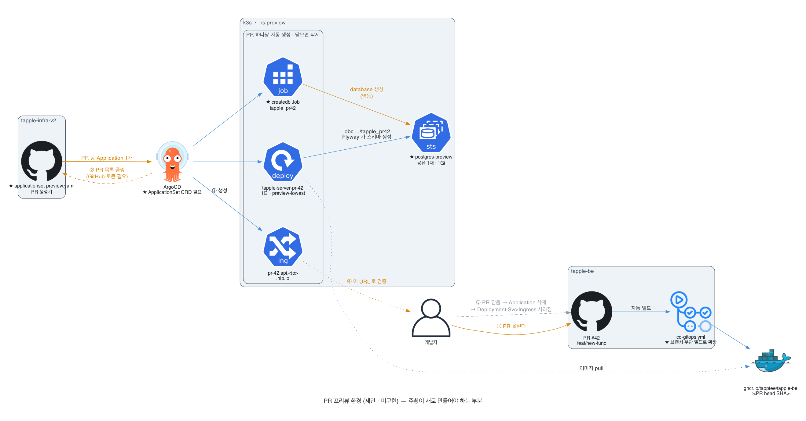

# 홈서버 → k3s 이전 & 운영 자동화 계획

> 결정 기록 + 단계별 계획. 구현체는 이 레포 루트([README.md](../README.md)).
> v2 (2026-08-07): **D4 변경 — PostgreSQL을 호스트가 아닌 k3s 내부(StatefulSet)로 운영.** 리소스 배분·Phase 순서 재계산.
> v3 (2026-08-10): **D2 변경 — 노드 4 vCPU/16GB → 8 vCPU/32GB.** dev 환경(D18)을 같은 클러스터에 상주시키기로 하면서 리소스 전면 재배분.
> v4 (2026-08-10): **tapple로 이식.** 원안은 UMC PRODUCT(AWS EC2+RDS 탈출)용으로 작성됐고, 매니페스트 구조·결정(D1~D19)은 그대로 유효하다. tapple의 출발점만 다르다 — 아래 As-Is 참고. 검증은 임시 VPS(141.164.40.139)에서 먼저 한다.

---

## 1. 개요

| 항목 | 내용 |
|---|---|
| 서비스 | tapple — NFC 명함/공개 프로필 (Spring Boot 멀티모듈 + PostgreSQL/Flyway) |
| 규모 | 트래픽 가벼움, 배포 잦음 |
| 목표 | 홈서버 docker compose 단일 배포 → 단일 노드 k3s + GitOps + OTel 관측성 |
| 핵심 원칙 | 비용 최소화, 단일 노드(SPOF 감수, RTO ~10분), 배포·복구 자동화 |

### As-Is
**실운영은 두 갈래이고 k3s는 아직 테스트다.** 홈서버를 폐기할 계획이 아니다.

- 로컬: 개발자 각자 `docker-compose-dev.yml` (postgres 포트 미노출)
- 홈서버(맥) + docker compose, GitHub Actions self-hosted runner(`deploy.yml`)가 main push마다 재기동
- DB: 같은 홈서버의 `postgres:16-alpine` 컨테이너 — DB명 `tapple`, 유저 `tapple` (`.env` 실측)
- 레거시: AWS EC2 + Docker Hub 경로(`cicd-prod.yml`)가 workflow_dispatch 전용으로 남아 있음 (백업 경로)
- 관측: `tapple-infra`(v1)의 compose Grafana 스택 — 부하 리그와 공용
- 비용: 홈서버 전기·회선 (클라우드 청구 없음). **iwinv 이전 시 월 요금이 새로 생긴다** — TODO: 상품 코드·요금 확인 후 이 줄에 기입

### To-Be
- 1대 노드(8 vCPU / 32GB)에 prod + dev 전부 수용. 지금은 임시 VPS, 확정 목표는 iwinv
- **App도 DB도 k3s 안** — 클러스터 상태 전체가 Git으로 복원됨
- OTel 풀스택 자체 호스팅 + ArgoCD GitOps + Cloudflare 프론트

### 이전으로 얻는 것 (홈서버 대비 — 컷오버 시점은 미정)
- 배포가 `git push` → ArgoCD pull로 바뀜. self-hosted runner가 맥에 붙어 있을 필요 없음
- 롤백이 Git revert 한 번. 지금은 compose 재기동
- prod/dev 분리가 네임스페이스로 생김 (현재 dev는 사실상 없음)
- 노드·DB·앱 리소스 한도가 명시됨 — 맥에서 다른 프로세스와 메모리를 다투지 않음

---

## 2. 확정된 결정 (Decision Record)

| # | 결정 항목 | 확정값 | 근거 |
|---|---|---|---|
| D1 | 클라우드 | **iwinv (스마일서브)** | 국내 자체 IDC, 동급 최저가 |
| D2 | 서버 플랜 | **8 vCPU / 32GB / NVMe · KR1** (v3에서 4 vCPU/16GB → 8 vCPU/32GB) — 정확한 상품 코드·요금은 발주 시 확인 | dev 환경(D18)을 같은 노드에 상주시키려면 16GB로는 여유가 ~1.5Gi뿐. 8코어/32GB면 requests 후 여유 ~10Gi / ~2.5 vCPU |
| D3 | 오케스트레이터 | **k3s 단일 노드** | 경량 컨트롤 플레인, 내장 Traefik/local-path |
| D4 | 데이터베이스 | **PostgreSQL StatefulSet, k3s 내부** (v2에서 변경) | 단일 노드라 호스트 분리의 가용성 이점이 절대적이지 않음. k3s 안에 넣으면 DB까지 GitOps 관리 → 재구축 시 ArgoCD apply로 전체 복원. eviction 리스크는 Guaranteed QoS + PriorityClass로 방어 |
| D5 | 앱 실행 | k8s Deployment (`app` 네임스페이스, Burstable) | 배포·롤백·자가치유 |
| D6 | 관측성 | OTel 풀스택 자체 호스팅 (Collector + Tempo + Loki + Prometheus + Grafana) — **조여서** 운영 | egress 0. 샘플링·짧은 보존 필수 |
| D7 | 배포 자동화 | ArgoCD (GitOps) + GitHub Actions | Git=클러스터 상태, 자동 동기화·롤백 |
| D8 | CI | GitHub Actions: 빌드 → `ghcr.io` → 매니페스트 이미지 태그 갱신 | ArgoCD가 감지해 자동 배포(풀형) |
| D9 | 인그레스 | Traefik (k3s 내장) | 별도 설치 불필요 |
| D10 | TLS/프론트 | Cloudflare 프록시(orange cloud) + origin cert, DNS도 Cloudflare | TLS 대행, 실 IP 은닉, 캐시, 무료 DDoS 방어 |
| D11 | 미디어/파일 | 오브젝트 스토리지(iwinv) | egress 절약, 600GB/월 한도 보호 |
| D12 | 트래픽 | iwinv 600GB/월 포함으로 충분 (추정 ~150GB/월) | 초과 알림만 설정 |
| D13 | 가용성(SLO) | 짧은 다운 허용, RTO ~10분 | 단일 노드 전제 |
| D14 | 백업/DR | `pg_dump` **CronJob**(k8s) → 오브젝트 스토리지(매일 + 배포 직전), k3s sqlite 스냅샷, 재구축 런북 | DB가 k8s 안이므로 백업도 k8s 매니페스트로 Git 관리 |
| D15 | 시크릿 | Sealed Secrets 권장 (또는 kubectl 수동) — 구현 시 확정 | GitOps라 평문 시크릿 Git 금지 |
| D16 | 서드파티 Helm | **vendoring 안 함.** ArgoCD Application이 upstream chart repo URL + values.yaml만 참조 | Git에는 values만. 차트 복사·포크 불필요 |
| D17 | PostgreSQL 차트 | **Bitnami 차트 사용 안 함** — 공식 `postgres` 이미지 + 자작 StatefulSet | 2025-08 Broadcom이 Bitnami 무료 이미지 중단(bitnamilegacy 이관). 단일 노드엔 StatefulSet ~60줄이면 충분, 오퍼레이터(CloudNativePG)는 과함 |
| D18 | 환경 분리 (v3 추가) | **같은 클러스터, 네임스페이스로 prod/dev 분리.** 브랜치로 환경을 나누지 않고 `apps/prod`·`apps/dev` 디렉터리 + `values.yaml`/`values-dev.yaml`로 분리. 앱 레포 브랜치는 트리거(develop→dev, main→prod) | 클러스터 2개는 비용 2배. dev는 `dev-low` PriorityClass로 압박 시 먼저 축출시켜 prod 보호. dev DB는 빈 DB + Flyway(운영 데이터 미복사) |
| D19 | 자작 앱 패키징 (v3 명문화) | **앱은 자작 Helm 차트, DB는 raw manifest** | 앱은 배포마다 `image.tag`가 바뀌어 템플릿·값 분리의 실익이 있고, 단일 인스턴스 DB는 바뀔 값이 없어 템플릿이 빈 껍데기 |

---

## 3. 목표 아키텍처

```
                        인터넷 (사용자 ~1,000명)
                              │
                    ┌─────────▼─────────┐
                    │    Cloudflare     │  TLS 종단 · 실IP 은닉 · 캐시 · DDoS
                    └─────────┬─────────┘
                              │ origin cert (HTTPS)
   ┌──────────────────────────▼──────────────────────────────────┐
   │  iwinv 노드 (8 vCPU / 32GB / NVMe · KR1)                      │
   │                                                              │
   │  ── 호스트 레벨 (system-reserved) ──                          │
   │     • OS + k3s (~2GB / ~1 vCPU)                              │
   │                                                              │
   │  ── k3s (단일 노드) ──                                        │
   │     [kube-system]  Traefik 인그레스 · sealed-secrets          │
   │     [db]           PostgreSQL StatefulSet 8Gi                │
   │                    (Guaranteed QoS · local-path PV · db-critical) │
   │     [app]          앱 Deployment 4Gi (app-important)         │
   │     [dev-db]       dev PostgreSQL 2Gi   ┐ dev-low            │
   │     [dev-app]      dev 앱 2Gi           ┘ (압박 시 첫 축출)    │
   │     [monitoring]   OTel Collector · Tempo · Loki ·          │
   │                    Prometheus · Grafana (prod·dev 공유)      │
   │     [argocd]       ArgoCD                                    │
   └───────────────┬──────────────────────────────────────────────┘
                   │ pg_dump CronJob / k3s 스냅샷 (매일 + 배포 직전)
          ┌────────▼────────┐
          │ 오브젝트 스토리지 │  DB 백업 · k3s 스냅샷 · 미디어
          │    (iwinv)      │
          └─────────────────┘

배포 흐름: git push → Actions 빌드 → ghcr.io → 매니페스트 태그 갱신 → ArgoCD 자동 배포
재구축 흐름: 노드 생성 → bootstrap 스크립트 → k3s 설치 → ArgoCD + root app apply
            → 클러스터 전체 자동 복원 → pg_restore(오브젝트 스토리지)
```

**핵심**: DB가 k3s 안이므로 클러스터 정의 전체가 Git 하나로 복원된다. 대신 DB 파드가 절대 쫓겨나지 않도록 QoS·우선순위 설정이 필수.

---

## 4. 리소스 배분 (8 vCPU / 32GB)

### 4-1. 호스트 레벨 (`system-reserved`)
| 대상 | RAM | vCPU |
|---|---|---|
| OS + k3s 컴포넌트 | ~2GB | ~1 |

→ k3s 설치 플래그: `system-reserved=cpu=1000m,memory=2Gi`, `eviction-hard=memory.available<1Gi`
→ **allocatable ≈ 30Gi / 7 vCPU**

### 4-2. 파드 풀
| 파드 | requests | limits | QoS | 비고 |
|---|---|---|---|---|
| PostgreSQL (`db`) | **8Gi / 2000m** | **8Gi / 2000m** | **Guaranteed** | requests==limits(cpu·mem 둘 다). `db-critical`. `shared_buffers=2GB` |
| 앱 (`app`) | 4Gi / 1000m | 6Gi / 3000m | Burstable | `app-important`. JVM MaxRAMPercentage=75 → 힙 ~4.5Gi |
| dev PostgreSQL (`dev-db`) | 2Gi / 250m | 2Gi / 1000m | Burstable | `dev-low`. `shared_buffers=512MB` |
| dev 앱 (`dev-app`) | 2Gi / 250m | 3Gi / 1500m | Burstable | `dev-low` |
| OTel 스택 (전체) | ~2.2Gi / 440m | ~3.3Gi | Burstable | prod·dev 공유. 샘플링 10% 유지 |
| ArgoCD + Traefik + sealed-secrets | ~1.3Gi / 530m | ~2Gi | Burstable | |
| **requests 합** | **~19.5Gi / 4.47 vCPU** | | | allocatable(30Gi / 7 vCPU) 대비 **~10Gi · ~2.5 vCPU 여유** |

> requests는 **스케줄러가 잡아두는 예약**일 뿐이라 유휴 CPU는 limits 한도까지 다른 파드가 쓴다 — prod 앱은 순간 3코어까지 뻗을 수 있다.

### 4-3. eviction 방어 (DB가 k8s 안이므로 필수)
- PostgreSQL: `requests == limits` (Guaranteed) → 메모리 압박 시 마지막에 축출
- PriorityClass 4단: `dev-low`(-100) → 모니터링·기본(0) → `app-important`(1000) → `db-critical`(1000000)
  → 압박 시 **dev가 가장 먼저 죽고 prod DB가 마지막**
- PV: local-path (NVMe 직접). 노드 소실 = 데이터 소실 → **백업이 유일한 복구선**

---

## 5. 구현 계획

### Phase 0 — 사전 준비
- [x] PostgreSQL 메이저 버전 — 홈서버 compose가 `postgres:16-alpine`이므로 **16** 고정
- [ ] iwinv 계정, **8 vCPU / 32GB** 플랜 프로비저닝(상품 코드·요금 확인), Ubuntu 22.04 LTS, SSH 키 등록
- [ ] Cloudflare 계정 + 도메인 네임서버 이전 (전파 시간 → 최우선 착수)
- [ ] iwinv 오브젝트 스토리지 버킷 + S3 호환 키 발급
- [ ] GitHub 레포 + `ghcr.io` 토큰

### Phase 1 — 노드 기본 세팅 (`infra/node-bootstrap.sh`)
- [ ] OS 업데이트, 타임존 Asia/Seoul, ufw: 22(본인 IP만)/80/443
- [ ] swap 비활성화, 비루트 배포 사용자, SSH 하드닝
- **검증**: `ufw status`에서 22/80/443만 개방

### Phase 2 — k3s 설치 (`infra/k3s-setup.sh`)
```bash
curl -sfL https://get.k3s.io | sh -s - \
  --write-kubeconfig-mode=644 \
  --kubelet-arg=system-reserved=cpu=500m,memory=2Gi \
  --kubelet-arg=eviction-hard=memory.available<1Gi
```
- [ ] ArgoCD 설치 후 root app apply (이후 전부 GitOps)
- [ ] 네임스페이스(`app`·`db`·`dev-app`·`dev-db`·`monitoring`)와 PriorityClass 3종은 **Git으로 배포됨** — `manifests/cluster/` (수동 생성 불필요)
- **검증**: `kubectl describe node`에서 Allocatable ≈ 30Gi

### Phase 3 — PostgreSQL (k3s 내부) + 데이터 이전
- [ ] StatefulSet 매니페스트 작성 (`manifests/postgres/`): 공식 `postgres:16` 이미지, local-path PVC, Guaranteed QoS, `db-critical` 우선순위
- [ ] 튜닝값(구현체는 ConfigMap 대신 컨테이너 args): `shared_buffers=2GB`, `effective_cache_size=6GB`, `work_mem=16MB`, `max_connections=60`(앱 Hikari 풀 10과 매칭)
- [ ] Service는 ClusterIP만 — 외부 노출 금지
- [ ] 홈서버 → 이전: `pg_dump`(홈서버 postgres 컨테이너) → `pg_restore`(파드). 컷오버 시점 재동기화
- **검증**: `kubectl exec`로 psql 접속, 테이블 100개+·인덱스 확인, `kubectl get pod -o jsonpath='{.status.qosClass}'` = Guaranteed

### Phase 4 — 앱 배포
- [ ] Dockerfile 정리, `ghcr.io` 빌드·푸시 테스트
- [ ] `app` Deployment + Service (§4-2 리소스), DB 접속은 `postgres.db.svc.cluster.local`
- [ ] 시크릿: D15 방식으로 생성
- **검증**: 파드 Running, 앱→DB 쿼리 성공

### Phase 5 — 인그레스 + Cloudflare + TLS
- [ ] Traefik IngressRoute, Cloudflare A 레코드 + orange cloud ON
- [ ] Origin Certificate 설치, SSL 모드 Full (strict), 정적 에셋 캐시 규칙
- **검증**: HTTPS 접속, dig로 실 IP 미노출 확인

### Phase 6 — OTel 관측성 (조여서)
- [ ] upstream Helm 차트로 배포(§D16): 트레이스 샘플링 5~10%, 보존 Tempo 3일/Loki 7일/Prometheus 15일, 파드별 memory limit 명시
- [ ] 앱 OTel SDK 계측, Grafana 대시보드 + 알림(노드 메모리, DB 연결 수, 에러율)
- **검증**: 트레이스/로그/메트릭 수집, `kubectl top pod -n monitoring` limit 내

### Phase 7 — ArgoCD (GitOps)
- [ ] ArgoCD 설치(리소스 limit 적용), app-of-apps로 db/app/monitoring Application 정의
- [ ] auto-sync + self-heal, UI는 별도 서브도메인 + Cloudflare Access
- **검증**: Git 변경 → 자동 반영, UI 롤백 동작

### Phase 8 — CI (GitHub Actions)
- [ ] build → `ghcr.io` 푸시(태그=커밋SHA) → 매니페스트 `image.tag` 갱신
- **검증**: push 한 번으로 배포까지 완주

### Phase 9 — 백업 / DR
- [ ] `pg_dump` **CronJob** (k8s, Git 관리): 매일 + 배포 직전(CI 트리거) → 오브젝트 스토리지, 보존 일 7/주 4
- [ ] k3s sqlite 스냅샷 → 오브젝트 스토리지
- [ ] 재구축 런북: 노드 생성 → Phase 1~2 스크립트 → ArgoCD + root app apply(클러스터 전체 복원) → pg_restore. RTO ~10분
- [ ] **복원 리허설 1회 필수**
- **검증**: 백업 생성 확인, 테스트 복원 성공

### Phase 10 — 검증 & 컷오버
- [ ] 스테이징 도메인 E2E → DB 최종 재동기화 → DNS 전환
- [ ] Grafana 관찰 → 안정화 후 홈서버 compose·self-hosted runner 정리 (레거시 EC2 경로도 같이 판단)
- **검증**: 실트래픽 정상, 청구액이 예상 범위 내

---

## 6. 주의사항

### OTel 조이기
- head sampling 5~10%, 에러는 tail sampling 고려
- 보존: Tempo 3일 / Loki 7일 / Prometheus 15일 이하
- Tempo/Loki/Prometheus `resources.limits.memory` 반드시 설정
- 계속 빡빡하면 저장 백엔드만 Grafana Cloud 무료티어 오프로드 (egress 발생)

### 단일 노드 리스크
- `system-reserved` 미설정 = 노드 OOM
- DB 파드 Guaranteed QoS + PriorityClass 미설정 = 메모리 압박 시 DB 축출 위험
- 미디어는 반드시 오브젝트 스토리지 (노드 직접 서빙 금지)
- local-path PV = 노드 소실 시 데이터 소실 → 백업 리허설 필수
- k3s 업그레이드 = DB 파드 재시작 = 짧은 다운 (RTO 허용 범위)

### 리사이즈 트리거
- 노드 available memory 지속 2GB 미만 or OOMKill 반복 → 상위 플랜 리사이즈 (수분)
- CPU throttling(`container_cpu_cfs_throttled_seconds`)이 지속되면 해당 파드의 limits부터 올리고, 노드 전체 사용률이 높으면 vCPU 상향
- dev까지 죽기 시작하면 이미 늦은 것 — Grafana 노드 메모리·CPU 알림을 먼저 본다

---

## 7. 리포지토리 구조

**구현 완료 (2026-08-10)** — 이 레포 루트가 실물이다. 구조 설명은 [README.md](../README.md).

```
tapple-infra-v2/
├─ bootstrap/root-app.yaml     # 재구축 시 수동 apply하는 유일한 파일 (app-of-apps 루트)
├─ apps/                       # ArgoCD Application 정의 — root가 재귀 sync
│  ├─ platform/                #   환경 공용: cluster(-3)·sealed-secrets(-2)·secrets(-1)·monitoring(2)
│  ├─ prod/                    #   postgres(0) · tapple-server(1)
│  └─ dev/                     #   postgres(0) · tapple-server(1)
├─ charts/tapple-server/          # 자작 Helm 차트 + values.yaml(prod) / values-dev.yaml (D19)
├─ manifests/
│  ├─ cluster/                 #   네임스페이스 5 + PriorityClass 3 (D18)
│  ├─ postgres/                #   prod DB — StatefulSet·Service·백업 CronJob (D17)
│  ├─ postgres-dev/            #   dev DB — 축소판
│  └─ monitoring/              #   대시보드 7 + 알림 규칙 2 (ConfigMap, 자동 생성)
├─ secrets/                    # kubeseal 암호문만 (D15)
├─ scripts/gen-configmaps.py   # v1(tapple-infra) 대시보드 원본 → ConfigMap 변환
├─ infra/                      # node-bootstrap.sh · k3s-setup.sh
└─ runbooks/disaster-recovery.md

tapple-be/.github/workflows/cd-gitops.yml  # build → ghcr.io → 이 레포 image.tag bump (D8)
```

*postgres-setup.sh 삭제됨 (v2) — DB가 k3s 매니페스트로 이동.*
*upstream 차트 values는 별도 파일이 아니라 Application 안 `valuesObject` 인라인 (v3 — D16 구현 형태 확정).*

---

## 8. 미해결 항목

**해결됨 (v3)**
- ~~1. 시크릿 방식~~ → Sealed Secrets 확정 (D15)
- ~~4. 앱 커넥션 풀 ↔ max_connections~~ → Hikari 10 ↔ `max_connections=60`
- ~~5. 모노레포 vs 분리 레포~~ → `Tapplee/tapple-infra-v2`로 분리 (D18)
- ~~6. Grafana 알림 채널~~ → Discord webhook, 기존 alertmanager 라우팅 이식

**남음**
1. 도메인/서브도메인 구조 — 지금은 `*.141.164.40.139.nip.io`. 앱·dev·Grafana·ArgoCD UI 전부 확정 필요
2. iwinv 32GB 플랜 상품 코드·월 요금 — 홈서버는 클라우드 청구가 없었으므로 **순증 비용**이다
3. k3s·ArgoCD 버전 고정 (재구축 재현성)
4. Traefik `trustedIPs` — Cloudflare 뒤에서 실 클라이언트 IP 복원
5. BE `prod` 프로파일의 CloudWatch appender — AWS 떠나면 무의미. k3s 전용 프로파일이 필요한지 결정
6. 미디어 스토리지 — 현재 AWS S3(`taple-bucket`). iwinv 오브젝트 스토리지로 옮길지, 그대로 둘지
7. 홈서버 배포(`deploy.yml`)와의 컷오버 순서 — 두 경로가 동시에 main을 배포하지 않게 (지금은 cd-gitops가 workflow_dispatch 전용)

**해결됨 (v4, tapple 이식)**
- ~~PostgreSQL 메이저 버전~~ → 현 운영과 같은 **16** 고정 (홈서버 compose가 `postgres:16-alpine`). 이전과 메이저 업그레이드를 한 번에 하지 않는다

---

## 9. 예상 결과

| 지표 | As-Is (홈서버 compose) | To-Be (k3s 단일 노드) |
|---|---|---|
| 월 비용 | 클라우드 청구 0 (전기·회선) | 32GB 플랜 요금 (발주 시 확정) — **순증** |
| 배포 | main push → self-hosted runner가 compose 재기동 | Git push → ArgoCD pull (GitOps) |
| 롤백 | compose 수동 | Git revert |
| 환경 | prod 사실상 단일 | prod / dev 네임스페이스 분리 |
| 관측성 | compose Grafana (리그와 공용) | 클러스터 내 OTel 풀스택 |
| 가용성 | — | 짧은 다운 허용, RTO ~10분 |
| 복구 | — | 스크립트 2개 + ArgoCD apply + pg_restore |

---

## 11. PR 프리뷰 환경 (제안 · 미구현)

`feat/new-func` 같은 브랜치를 올리면 그 PR 만의 URL 이 생기고, PR 을 닫으면 사라지는 환경.
dev 환경 하나를 여러 작업이 번갈아 쓰면서 서로 덮어쓰는 문제를 없앤다.



### 장치

ArgoCD **ApplicationSet** 의 Pull Request 생성기. PR 목록을 폴링해 PR 하나당 Application 을
자동 생성하고, PR 이 닫히면 그 Application 을 지운다.

### 설계 판단 세 개

**① 네임스페이스를 PR 마다 만들지 않고 `preview` 하나로 모은다**

SealedSecret 은 (네임스페이스, 이름)에 묶여 암호화된다. PR 마다 네임스페이스를 만들면
시크릿을 재사용할 수 없고, PR 이 열릴 때마다 사람이 씰링해야 하면 자동화가 성립하지 않는다.
`cluster-wide` 스코프로 씰링하는 방법도 있지만 그건 그 시크릿을 **아무 네임스페이스에서나**
풀 수 있게 만드는 것이라, 프리뷰 편의로 감수할 트레이드오프가 아니다.

**② DB 는 프리뷰 전용 postgres 한 대를 공유하고 PR 마다 database 를 나눈다**

database 를 나누지 않으면 여러 PR 의 Flyway 가 같은 스키마를 동시에 고쳐 서로를 깬다.
반대로 postgres 를 PR 마다 띄우면 메모리가 남지 않는다(아래 예산).
`CREATE DATABASE` 는 postgres 가 자동으로 해주지 않으므로 멱등 Job 이 필요하다.

**③ 우선순위를 dev 보다 더 낮게 둔다**

메모리 압박 시 프리뷰가 가장 먼저 죽어야 한다. `dev-low`(-100) 아래 `preview-lowest` 를 새로 만든다.

### 메모리 예산 (2026-08-11 실측 기준)

| | |
|---|---|
| allocatable | 28.3 Gi |
| 현재 requests | 18.5 Gi |
| 여유 | **9.8 Gi** |
| 프리뷰 공유분 (postgres-preview) | 1 Gi (1회) |
| PR 당 | 1 Gi (앱만, prod 의 1/4) |
| **동시 PR 최대** | **약 8개** — 여유 2Gi 를 남기면 **6개 권장** |

### 만들어야 할 것

- [ ] **`applicationsets.argoproj.io` CRD** — 지금 클러스터에 **없다**. 첫 ArgoCD 설치가
      애노테이션 크기 오류로 실패했을 때 이것만 안 들어왔다. 컨트롤러는 1/1 Running 인데
      감시할 CRD 가 없어 헛돌고 있다. 프리뷰와 무관하게 고칠 값어치가 있다
- [ ] `applicationset-preview.yaml` — PR 생성기 + PR 목록 조회용 GitHub 토큰(tapple-be 가 private)
- [ ] `cd-gitops.yml` 확장 — 현재 `main`·`dev` 만 빌드한다. 기능 브랜치도 이미지를 만들어야 한다
      (인프라 레포 태그 커밋은 필요 없다 — ApplicationSet 이 PR head SHA 를 직접 읽는다)
- [ ] `manifests/postgres-preview/` — 공유 postgres 1대 (튜닝값 축소, 백업 없음)
- [ ] `createdb` Job — 멱등 `CREATE DATABASE tapple_pr<N>`
- [ ] `preview-lowest` PriorityClass
- [ ] 정리 경로 — PR 이 닫히면 Application 은 사라지지만 **database 는 남는다**. 주기적으로
      지우는 CronJob 이나 PR 닫힘 훅이 필요하다

### 할 값어치가 있나

프리뷰 환경의 값어치는 **보는 사람이 여러 명일 때** 가장 크다 — 디자이너·기획이 URL 로 확인하거나,
FE 가 BE 브랜치를 붙여보거나, 동시 PR 이 여러 개일 때. 지금은 1인이고 `dev` 브랜치가
그 역할을 하며, 로컬 compose 가 브랜치별 테스트를 담당한다.

즉 **지금 당장 필요한 것은 아니다.** 다만 아픈 지점이 하나 있다 — dev 환경이 하나뿐이라
두 작업이 겹치면 서로를 덮는다. 그게 실제로 불편해지는 시점이 도입 신호다.
