# secrets — AWS Secrets Manager + External Secrets Operator

시크릿의 원본은 AWS Secrets Manager다. Git에는 값·암호문·복호화 키를 두지 않고,
`charts/tapple-secrets/values.yaml`에 **JSON Secret 계약**만 둔다. External Secrets
Operator(ESO) 2.10.0이 13개의 AWS Secret을 15개의 `ExternalSecret`을 통해 기존
Kubernetes Secret 이름으로 동기화한다.

```mermaid
flowchart LR
  Ansible[Ansible controller] -->|stdin, no_log| Zero[external-secrets/aws-bootstrap]
  Zero --> ESO[External Secrets Operator 2.10.0]
  ESO -->|STS AssumeRole + session tags| Role[환경별 IAM Role 6개]
  Role -->|GetSecretValue| SM[AWS Secrets Manager\nJSON Secret 13개]
  SM --> ES[ExternalSecret 15개]
  ES --> Secret[Kubernetes Secret]
  Secret --> Workload[앱 · DB · Grafana · Alertmanager]
```



`aws-bootstrap`은 AWS 밖의 IDC 서버에서 이 순환 의존을 끊는 유일한 secret-zero다.
bootstrap IAM 사용자는 Secrets Manager를 직접 읽을 수 없고 `tapple-secrets-*` 역할만
가정한다. 각 역할은 자기 경로의 `secretsmanager:GetSecretValue`만 허용한다.

중요한 한계가 있다. bootstrap access key 소유자는 요청 session tag를 직접 정해 여섯 역할
모두에 `AssumeRole`할 수 있다. `esoNamespace`·`esoStoreName` 조건은 잘못된 Store 설정을
막고 CloudTrail 감사 정보를 남기는 **사고 방지 장치**이지, 탈취된 key를 막는 보안 경계가
아니다. 장기 access key는 Phase 1의 명시적인 보안 부채다. 키 회전 부담이나 위협 모델이
커지면 AWS IAM Roles Anywhere의 단기 자격증명으로 교체한다.

ESO controller 자체도 upstream ClusterRole로 모든 namespace의 Kubernetes Secret을
관리한다. 현재 클러스터는 한 운영 경계이고 외부/fork PR을 받지 않아 단일 controller를
선택했다. namespace를 다른 팀에 위임하거나 외부 코드를 실행하는 멀티테넌트 단계에서는
prod/non-prod controller와 bootstrap principal을 분리하는 것이 전환 조건이다.

## 환경 경계: 6 roles / 10 stores

| IAM role | namespace / `SecretStore` | 허용 Secrets Manager 이름 |
|---|---|---|
| `tapple-secrets-prod` | `app/aws-secretsmanager` | `/tapple/prod/app-secrets` |
| `tapple-secrets-prod` | `db/aws-secretsmanager` | `/tapple/prod/postgres-secrets`, `/tapple/prod/postgres-readonly`, `/tapple/prod/backup-s3` |
| `tapple-secrets-dev` | `dev-app/aws-secretsmanager` | `/tapple/dev/app-secrets` |
| `tapple-secrets-dev` | `dev-db/aws-secretsmanager` | `/tapple/dev/postgres-secrets` |
| `tapple-secrets-preview` | `preview/aws-secretsmanager` | `/tapple/preview/app-secrets`, `/tapple/preview/postgres-preview-secrets` |
| `tapple-secrets-monitoring` | `monitoring/aws-secretsmanager` | `/tapple/platform/monitoring/grafana-admin`, `/tapple/platform/monitoring/grafana-origin-tls`, `/tapple/platform/monitoring/alertmanager-discord` |
| `tapple-secrets-argocd` | `argocd/aws-secretsmanager` | `/tapple/platform/argocd/preview-github-token` |
| `tapple-secrets-shared` | `app/aws-secretsmanager-shared` | `/tapple/shared/ghcr-pull` |
| `tapple-secrets-shared` | `dev-app/aws-secretsmanager-shared` | `/tapple/shared/ghcr-pull` |
| `tapple-secrets-shared` | `preview/aws-secretsmanager-shared` | `/tapple/shared/ghcr-pull` |

공유 경로에는 정말 공유하기로 결정한 `ghcr-pull` 하나만 둔다. prod의 애플리케이션·DB
자격증명을 dev나 preview와 공유하지 않는다.

## JSON Secret 계약: 13 source / 15 ExternalSecrets

한 key마다 AWS Secret을 만들지 않는다. 기존 Kubernetes Secret 계약 하나를 Secrets
Manager의 JSON Secret 하나로 묶어 비용과 운영 오브젝트 수를 줄이고, ESO의 `data` 매핑으로
허용한 JSON property만 가져온다. 아래 표가 `charts/tapple-secrets/values.yaml`의 현재 계약이다.

| AWS Secrets Manager 이름 | JSON property 집합 | 생성되는 `namespace/Secret` |
|---|---|---|
| `/tapple/prod/app-secrets` | `app-full` | `app/app-secrets` |
| `/tapple/dev/app-secrets` | `app-full` | `dev-app/app-secrets` |
| `/tapple/preview/app-secrets` | `app-preview` | `preview/app-secrets` |
| `/tapple/prod/postgres-secrets` | `POSTGRES_DB`, `POSTGRES_PASSWORD`, `POSTGRES_USER` | `db/postgres-secrets` |
| `/tapple/prod/postgres-readonly` | `RO_PASSWORD` | `db/postgres-readonly` |
| `/tapple/prod/backup-s3` | `AWS_ACCESS_KEY_ID`, `AWS_SECRET_ACCESS_KEY`, `AWS_REGION`, `S3_BUCKET`, `S3_EXPECTED_BUCKET_OWNER` | `db/backup-s3` |
| `/tapple/dev/postgres-secrets` | `POSTGRES_DB`, `POSTGRES_PASSWORD`, `POSTGRES_USER` | `dev-db/postgres-secrets` |
| `/tapple/preview/postgres-preview-secrets` | `POSTGRES_PASSWORD`, `POSTGRES_USER` | `preview/postgres-preview-secrets` |
| `/tapple/shared/ghcr-pull` | `dockerconfigjson` | `app/ghcr-pull`, `dev-app/ghcr-pull`, `preview/ghcr-pull` |
| `/tapple/platform/monitoring/grafana-admin` | `admin-password`, `admin-user` | `monitoring/grafana-admin` |
| `/tapple/platform/monitoring/grafana-origin-tls` | `certificate`, `private-key` | `monitoring/grafana-origin-tls` (`kubernetes.io/tls`의 `tls.crt`, `tls.key`) |
| `/tapple/platform/monitoring/alertmanager-discord` | `discord-webhook` | `monitoring/alertmanager-discord` |
| `/tapple/platform/argocd/preview-github-token` | `token` | `argocd/preview-github-token` |

`app-full`은 다음 34개 property를 정확히 포함한다.

```text
CORS_ALLOWED_ORIGINS
DISCORD_ERRORS_ID
DISCORD_ERRORS_TOKEN
DISCORD_NOTIFY_ID
DISCORD_NOTIFY_TOKEN
FRONTEND_GOOGLE_COMPLETE_URI
GOOGLE_CLIENT_ID
GOOGLE_CLIENT_SECRET
GOOGLE_REDIRECT_URI
HIBERNATE_SHOW_SQL
HIKARI_MAX_POOL_SIZE
HIKARI_MIN_IDLE
JWT_ACCESS_EXPIRATION
JWT_REFRESH_EXPIRATION
JWT_SECRET_KEY
OTEL_AUTH_HEADER
POSTGRES_PASSWORD
POSTGRES_USERNAME
PUBLIC_API_ORIGIN
PUBLIC_ASSET_ORIGIN
PUBLIC_MEDIA_ORIGIN
PUBLIC_SITE_ORIGIN
REFRESH_COOKIE_SAME_SITE
REFRESH_COOKIE_SECURE
S3_ACCESS_KEY
S3_BUCKET_NAME
S3_REGION
S3_SECRET_KEY
SHARE_PREVIEW_LOG_HMAC_KEY
SHARE_PREVIEW_PREVIOUS_SERVICE_TOKEN
SHARE_PREVIEW_SERVICE_TOKEN
SLUG_RESERVATION_HMAC_KEY
SLUG_RESERVATION_HMAC_KEY_VERSION
SWAGGER_REDIRECT_URI
```

`app-preview`는 PR마다 달라 ApplicationSet이 평문 설정으로 넣는 URL·CORS·리다이렉트
property를 제외한 다음 26개다.

```text
DISCORD_ERRORS_ID
DISCORD_ERRORS_TOKEN
DISCORD_NOTIFY_ID
DISCORD_NOTIFY_TOKEN
GOOGLE_CLIENT_ID
GOOGLE_CLIENT_SECRET
HIBERNATE_SHOW_SQL
HIKARI_MAX_POOL_SIZE
HIKARI_MIN_IDLE
JWT_ACCESS_EXPIRATION
JWT_REFRESH_EXPIRATION
JWT_SECRET_KEY
OTEL_AUTH_HEADER
POSTGRES_PASSWORD
POSTGRES_USERNAME
REFRESH_COOKIE_SAME_SITE
REFRESH_COOKIE_SECURE
S3_ACCESS_KEY
S3_BUCKET_NAME
S3_REGION
S3_SECRET_KEY
SHARE_PREVIEW_LOG_HMAC_KEY
SHARE_PREVIEW_PREVIOUS_SERVICE_TOKEN
SHARE_PREVIEW_SERVICE_TOKEN
SLUG_RESERVATION_HMAC_KEY
SLUG_RESERVATION_HMAC_KEY_VERSION
```

AWS의 `dockerconfigjson` property 값은 base64 문자열이 아니라 완성된 Docker config JSON
원문이다. ESO의 GJSON 경로 문법과 충돌하지 않도록 source property에는 선행 점을 쓰지 않고,
ExternalSecret이 Kubernetes target key를 `.dockerconfigjson`으로 매핑해
`kubernetes.io/dockerconfigjson` 타입을 만든다.

`OTEL_TRACE_SAMPLE`은 시크릿이 아니라 배포 정책이므로 세 환경 모두 Helm의 명시적
`env`에서 `1.0`으로 고정한다. 기존 테스트 클러스터의 `app-secrets`에 이 key가 남아 있어도
명시적 `env`가 `envFrom`보다 우선하지만, 아래 보존·폐기 절차에 따라 source와 Kubernetes
Secret에서 제거해 계약을 정리한다.

### 알려진 호환 부채: 앱의 DB 값 중복

`app-secrets`의 `POSTGRES_USERNAME`·`POSTGRES_PASSWORD`와 DB 계열 Secret의
`POSTGRES_USER`·`POSTGRES_PASSWORD`는 같은 계정 값을 서로 다른 JSON Secret에 중복한다.
현재 애플리케이션 `envFrom` 계약을 깨지 않기 위한 호환 부채이므로 prod·dev·preview에서
각 쌍을 반드시 같은 값으로 유지한다. DB 비밀번호를 회전할 때 두 source를 함께 바꾸고,
추후 앱 Deployment가 DB Secret을 별도로 참조하도록 바꾸면 중복을 제거한다.

## 처음 구성

### 1. IAM user와 역할 생성

CloudFormation은 bootstrap IAM user와 여섯 역할만 만든다. access key와 실제 Secret은 만들지 않는다.

```bash
aws cloudformation deploy \
  --stack-name tapple-external-secrets-iam \
  --template-file infra/aws/external-secrets-iam.yaml \
  --region ap-northeast-2 \
  --capabilities CAPABILITY_NAMED_IAM
```

AWS 계정 ID를 확인해 `charts/tapple-secrets/values.yaml`의 `aws.accountId`에 커밋한다.
빈 값이나 12자리 숫자가 아니면 Helm 렌더가 실패한다. 계정 ID는 비밀이 아니다.

```bash
aws sts get-caller-identity --query Account --output text
```

AWS Console의 IAM 사용자 `tapple-external-secrets-bootstrap` → **Security credentials**에서
access key 하나를 발급해 승인된 비밀 관리 도구에 바로 저장한다. secret access key는 생성
직후에만 보이므로 터미널 출력·스크린샷·다운로드 폴더에 남기지 않는다. 이 key는 Secret을
직접 읽지 못하지만 여섯 환경 역할을 모두 가정할 수 있으므로 prod급 자격증명으로 취급한다.

현재 IAM 정책은 AWS 관리형 Secrets Manager key(`alias/aws/secretsmanager`)를 전제로 한다.
customer-managed KMS key로 바꾸면 각 역할에 해당 key ARN의 `kms:Decrypt` 권한과 key policy를
추가해야 한다. 그 변경 없이 CMK로 암호화하면 ExternalSecret은 `AccessDenied`가 된다.

### 2. PostgreSQL backup 전용 AWS S3 경계

애플리케이션 미디어 bucket·자격증명과 backup을 공유하지 않는다. 별도 stack은 35일
current-object 만료, 35일 noncurrent version 만료, versioning, SSE-S3, public access block,
bucket-owner-enforced와 TLS 강제를 설정한다. bucket은 stack 삭제·교체에도 `Retain`한다.

```bash
aws cloudformation deploy \
  --stack-name tapple-postgres-backup-s3 \
  --template-file infra/aws/postgres-backup-s3.yaml \
  --region ap-northeast-2 \
  --capabilities CAPABILITY_NAMED_IAM \
  --parameter-overrides BackupBucketName=전역에서-고유한-backup-bucket-name

aws cloudformation describe-stacks \
  --stack-name tapple-postgres-backup-s3 \
  --region ap-northeast-2 \
  --query 'Stacks[0].Outputs' --output table
```

stack은 `postgres/prod/*`에 `PutObject`·`AbortMultipartUpload`만 할 수 있고 bucket 위치만
확인할 수 있는 `tapple-postgres-backup-writer` IAM user를 만든다. access key는
CloudFormation output이나 state에 남기지 않기 위해 만들지 않는다. AWS Console에서 이 user의
access key 하나를 수동 발급해 승인된 비밀 관리 도구에 바로 보관하고, 다음 JSON을
`/tapple/prod/backup-s3`에 입력한다.

```text
AWS_ACCESS_KEY_ID
AWS_SECRET_ACCESS_KEY
AWS_REGION
S3_BUCKET
S3_EXPECTED_BUCKET_OWNER
```

`AWS_REGION`은 stack을 배포한 region, `S3_BUCKET`은 stack의 `BackupBucketName`,
`S3_EXPECTED_BUCKET_OWNER`는 `BackupBucketOwnerAccountId` output이다. writer는 기존 backup을
list/read/delete할 수 없다. 복구 담당자는 별도의 승인된 AWS 운영 자격증명으로 객체를
조회·다운로드한다. 이 분리는 클러스터 자격증명이 탈취돼도 기존 복구 지점을 읽거나 지우지
못하게 하지만, key 발급·회전과 복구 권한 운영이 한 단계 늘어나는 tradeoff가 있다.

### 3. 13개의 JSON Secret 입력

가장 안전하고 단순한 방법은 AWS Console의 Secrets Manager 편집 화면이다. CLI가 필요하면
시크릿 값을 `--secret-string '{...}'`처럼 명령행에 직접 쓰지 않는다. repo 밖에 권한이 제한된
임시 파일을 만들고 `file://`로 전달한 뒤 즉시 삭제한다.

```bash
secret_file="$(mktemp)"
chmod 600 "${secret_file}"
trap 'rm -f "${secret_file}"' EXIT
"${EDITOR:-vi}" "${secret_file}"

# 신규 source일 때만 실행한다.
aws secretsmanager create-secret \
  --name /tapple/prod/app-secrets \
  --region ap-northeast-2 \
  --secret-string "file://${secret_file}"

# 기존 source라면 위 명령 대신 이것만 실행한다.
aws secretsmanager put-secret-value \
  --secret-id /tapple/prod/app-secrets \
  --region ap-northeast-2 \
  --secret-string "file://${secret_file}"
```

한 임시 파일을 다른 Secret에 재사용하지 않는다. CI 로그·셸 history·채팅·Git diff에 값이
나타나지 않았는지 확인한다. 과거 Git 이력이나 테스트 클러스터에 있던 키·토큰·비밀번호는
재사용하지 않는다. 최초에 이전 서비스 토큰이 없다면
`SHARE_PREVIEW_PREVIOUS_SERVICE_TOKEN`에는 현재 `SHARE_PREVIEW_SERVICE_TOKEN`과 같은 값을
넣고 다음 회전 때 이전 값으로 교체한다.

### 4. canonical bootstrap: Ansible

Ubuntu 22.04/24.04 x86_64 IDC 서버 한 대의 정식 경로는 [Ansible 가이드](../ansible/README.md)다.
inventory의 `CHANGE_ME`를 모두 바꾸고 SSH allowlist를 검토한 뒤 실행한다.

```bash
cd ansible
python3 -m venv .venv
. .venv/bin/activate
pip install -r requirements.txt
cp inventories/idc/hosts.example.yml inventories/idc/hosts.yml

ansible-playbook --syntax-check playbooks/bootstrap.yml
ansible-playbook --check --tags preflight playbooks/bootstrap.yml
ansible-playbook playbooks/bootstrap.yml
```

기본 실행은 access key ID와 secret access key를 화면에 표시하지 않고 묻는다. 자동화에서는
승인된 controller secret store에서 `ESO_AWS_ACCESS_KEY_ID`와
`ESO_AWS_SECRET_ACCESS_KEY` 환경변수를 주입한다. inventory, vars 파일, 셸 명령행
`--extra-vars`에는 평문 자격증명을 넣지 않는다. Ansible은 `no_log`를 적용하고 Kubernetes
Secret 정의를 프로세스 인자가 아닌 stdin으로 전달한다.

`infra/k3s-setup.sh`와 `scripts/bootstrap-external-secrets-aws.sh`는 복구용 fallback이다.
새 노드의 표준 설치·재실행 경로는 Ansible이다.

### 5. 준비 상태 확인

Ansible은 root Application 전에 Argo CD의 `Application`·`SecretStore`·`ExternalSecret`
custom health를 적용한다. 따라서 sync wave는 오브젝트 생성 순서만 정하는 데서 끝나지 않고,
하위 Application과 시크릿이 실제 `Healthy`/`Ready=True`가 될 때까지 다음 wave를 막는다.

```bash
kubectl wait --for=condition=Ready secretstore --all -A --timeout=180s
kubectl wait --for=condition=Ready externalsecret --all -A --timeout=300s
kubectl get secretstore,externalsecret -A
kubectl get secret app-secrets -n app \
  -o go-template='{{range $key, $_ := .data}}{{println $key}}{{end}}'
```

AWS Secret이 하나라도 없거나 JSON property가 빠지면 해당 ExternalSecret은 Ready가 되지 않고
후속 DB·앱 Application도 진행되지 않는다. 위 확인 명령은 값이 아니라 이름과 key 목록만 본다.

## 갱신과 수동 회전

ESO는 한 시간마다 source를 다시 읽지만 `env`/`envFrom`으로 받은 값은 실행 중인 프로세스에
자동 반영되지 않는다. source의 새 버전을 넣은 뒤 즉시 적용할 때는 다음 순서를 사용한다.

```bash
kubectl annotate externalsecret app-secrets -n app \
  external-secrets.io/force-sync="$(date +%s)" --overwrite
kubectl wait --for=condition=Ready externalsecret/app-secrets -n app --timeout=180s
kubectl rollout restart deployment/tapple-server -n app
kubectl rollout status deployment/tapple-server -n app --timeout=300s
```

PostgreSQL 비밀번호는 source만 바꾸면 안 된다. 컨테이너의 `POSTGRES_PASSWORD`는 최초 DB
생성에만 쓰이므로 실제 role 비밀번호와 앱 자격증명을 함께 전환해야 한다. 현재 중복 계약에서는
DB JSON Secret과 app JSON Secret에 새 값을 모두 준비하고, 두 ExternalSecret의 동기화와 key를
확인한 뒤 실제 role 비밀번호 변경과 앱 rollout을 연속 수행한다. 기존 Pod가 이전 env를 들고
있기 때문에 role 변경부터 rollout 완료까지가 장애 위험 구간이다.

Grafana `admin-password`는 최소 20자의 고유한 임의 값으로 생성한다. chart의 비밀번호 정책은
bootstrap Secret을 검증하지 않는다. 이 값은 최초 부팅용이며, 기존 PVC 안의 사용자 비밀번호를
자동 변경하지 않는다. 이후 승인 사용자와 비밀번호는 Grafana에서 운영한다. 공개 가입과 익명 접근은 꺼져 있어
운영자가 만든 로컬 계정만 로그인한다. `grafana-origin-tls`는 Cloudflare Origin Certificate와
private key이며 Full (strict) origin TLS에 사용한다. 상세 절차는
[모니터링 접속 가이드](../docs/monitoring-access.md)에 있다.

Secrets Manager의 자동 회전은 지금 켜지 않는다. 회전 Lambda가 IDC의 PostgreSQL·대상 서비스에
도달할 네트워크 경로가 없고, source만 바꾸면 되는 시크릿과 대상 시스템까지 함께 바꿔야 하는
시크릿이 섞여 있기 때문이다. VPN·터널·제한된 인바운드 등 경로와 무중단 회전 계약을 먼저
설계하고 복원 환경에서 검증한 뒤 별도 단계로 도입한다.

### bootstrap access key 회전

새 key를 안전하게 발급해 승인된 secret store에 넣은 뒤 Ansible을 다시 실행한다. ESO가
재시작되고 모든 Store가 Ready인 것을 확인한 다음 이전 IAM access key를 비활성화하고 삭제한다.
장기 key의 회전 주기와 담당자를 운영 캘린더에 명시한다.

### PostgreSQL backup writer access key 회전

`tapple-postgres-backup-writer`는 최대 두 access key 중 하나만 정상 운영에 둔다. 새 key를
AWS Console에서 발급해 승인된 비밀 관리 도구에 저장한 뒤, `/tapple/prod/backup-s3` JSON의
두 access-key property만 새 값으로 갱신한다. 터미널·Git·Kubernetes manifest에 값을 쓰지 않는다.
회전은 정규 03:00 Job의 최대 2시간 실행 창 밖에서 하고, 수동 Job을 만들기 직전에 active
backup Job이 없음을 확인한다. `concurrencyPolicy: Forbid`는 수동 생성 Job과의 동시 실행까지
막아주지 않는다.

```bash
set -euo pipefail

before_refresh="$(kubectl get externalsecret backup-s3 -n db \
  -o jsonpath='{.status.refreshTime}')"
kubectl annotate externalsecret backup-s3 -n db \
  external-secrets.io/force-sync="$(date +%s)" --overwrite

# 기존 Ready=True를 즉시 통과하지 말고 force-sync 뒤 refreshTime이 실제 바뀔 때까지 기다린다.
attempts=0
while :; do
  after_refresh="$(kubectl get externalsecret backup-s3 -n db \
    -o jsonpath='{.status.refreshTime}')"
  ready="$(kubectl get externalsecret backup-s3 -n db \
    -o jsonpath='{.status.conditions[?(@.type=="Ready")].status}')"
  if test "$ready" = True && test -n "$after_refresh" \
    && test "$after_refresh" != "$before_refresh"; then
    break
  fi
  attempts=$((attempts + 1))
  if test "$attempts" -ge 90; then
    echo "backup-s3 ExternalSecret가 새 version으로 갱신되지 않았습니다." >&2
    exit 1
  fi
  sleep 2
done

active_backups="$(kubectl get jobs -n db \
  -l app.kubernetes.io/name=pg-backup \
  -o jsonpath='{range .items[*]}{.metadata.name}{" "}{.status.active}{"\n"}{end}' \
  | awk '$2 + 0 > 0 { print $1 }')"
if test -n "$active_backups"; then
  echo "active backup Job이 있어 회전을 중단합니다: $active_backups" >&2
  exit 1
fi

rotation_job="pg-backup-key-rotation-$(date -u +%Y%m%d%H%M%S)"
kubectl create job -n db --from=cronjob/pg-backup "$rotation_job"
kubectl wait --for=condition=Complete "job/$rotation_job" -n db --timeout=7200s
rotation_pod_uid="$(kubectl get pod -n db -l "job-name=$rotation_job" \
  -o jsonpath='{.items[?(@.status.phase=="Succeeded")].metadata.uid}')"
case "$rotation_pod_uid" in
  ????????-????-????-????-????????????) ;;
  *) exit 1 ;;
esac
```

승인된 클러스터 밖 복구 자격증명(`ListBucket`·`ListBucketMultipartUploads`·
`GetObject`·`GetObjectVersion`, write/delete 없음)으로 새 `.complete` marker와 세 객체를 확인하고,
[DR 런북](../runbooks/disaster-recovery.md)의 checksum·`pg_restore --list`·임시 DB restore까지
통과시킨다. 이때 marker 이름이 `-${rotation_pod_uid}.dump.complete`로 끝나는지 확인해야 다른
정규 Job의 성공을 새 key 검증으로 오인하지 않는다. 같은 자격증명으로 `postgres/prod/`의
미완료 multipart upload가 없는지도 확인한다.
그 뒤에만 이전 access key를 disable하고 다음 정규 backup 성공을 본 후 삭제한다. 실패하면 이전
key를 다시 enable하고 Secrets Manager를 이전 version으로 되돌린다. 회전 주기·담당자는 운영
캘린더에 명시하며 복구 read identity와 writer key를 같은 보관 항목으로 합치지 않는다.

## 보존·폐기와 레거시 정리

`creationPolicy: CreateOrMerge`와 `deletionPolicy: Retain`이라 ExternalSecret을 실수로 prune해도
생성된 Kubernetes Secret은 남는다. 시크릿을 폐기할 때는 다음 세 대상을 의식적으로 함께 정리한다.

1. Secrets Manager source와 복구 기간
2. `charts/tapple-secrets/values.yaml`의 ExternalSecret 계약
3. 해당 Kubernetes Secret과 그것을 읽는 workload

이 보존 정책은 JSON property를 계약에서 뺄 때 기존 Kubernetes Secret key를 자동 삭제하지
않는다. key를 제거하는 변경은 소비 workload를 먼저 확인한 뒤 target Secret의 해당 key(또는
target 전체)를 명시적으로 지우고 ExternalSecret을 force-sync해 현재 계약만 다시 만든 다음,
값이 아닌 key 목록으로 결과를 검증한다.

이 전환은 운영 전이므로 이전 값을 인수하지 않는다. 과거 Sealed Secrets controller를 사용한
테스트 클러스터는 CRD보다 리소스를 먼저 지운다.

```bash
if kubectl api-resources --api-group=bitnami.com -o name | grep -qx sealedsecrets.bitnami.com; then
  kubectl delete sealedsecrets.bitnami.com --all -A
fi
kubectl delete application sealed-secrets -n argocd --ignore-not-found
if kubectl get deployment sealed-secrets-controller -n kube-system >/dev/null 2>&1; then
  kubectl wait --for=delete deployment/sealed-secrets-controller \
    -n kube-system --timeout=180s
fi

# controller가 멈춘 것을 확인한 뒤 런타임 private sealing key도 폐기한다.
kubectl get secret -n kube-system \
  -l sealedsecrets.bitnami.com/sealed-secrets-key -o name
kubectl delete secret -n kube-system \
  -l sealedsecrets.bitnami.com/sealed-secrets-key
```

과거 암호문은 Git 이력에 남을 수 있으므로 거기에 있던 값을 새 Secrets Manager Secret에
재사용하지 않는다.

삭제한 씰링 workflow가 사용하던 GitHub Actions repository secret도 자동으로 없어지지 않는다.
운영 전 전환 때 이 레포의 **Settings → Secrets and variables → Actions**에서 아래 다섯 이름을
삭제하고, 값의 원본 자격증명도 공급자에서 폐기한다.

- `GHCR_USERNAME`, `GHCR_PAT`
- `PREVIEW_GITHUB_TOKEN`
- `GRAFANA_GOOGLE_CLIENT_ID`, `GRAFANA_GOOGLE_CLIENT_SECRET`

기존 GHCR/PREVIEW PAT는 GitHub에서 revoke하고 새 fine-grained token만 Secrets Manager에 넣는다.
과거 Grafana Google OAuth client secret도 더 이상 쓰지 않으므로 Google Cloud Console에서
폐기한다. repository secret 삭제만으로 원본 PAT/OAuth secret이 무효화되지는 않는다.
